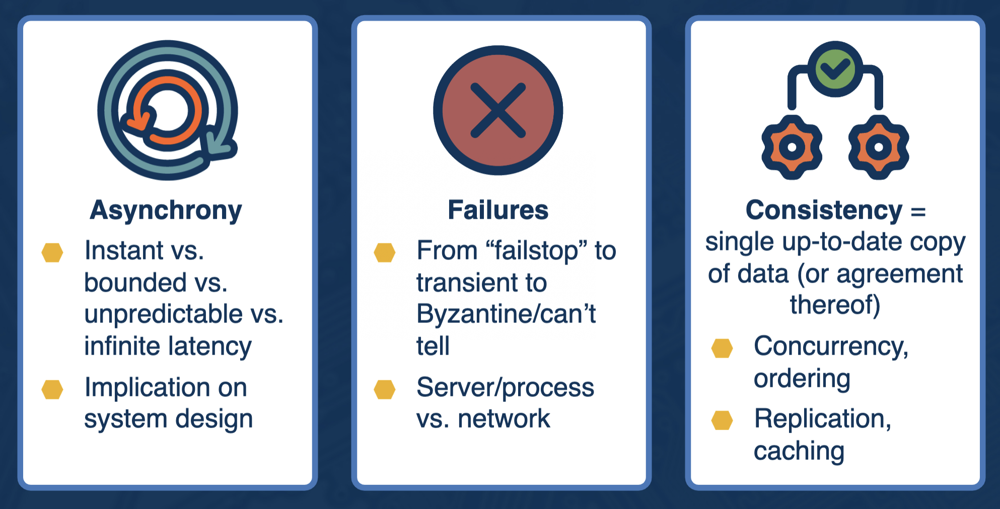
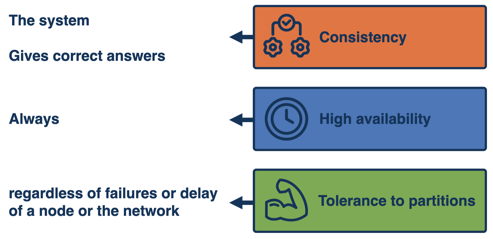
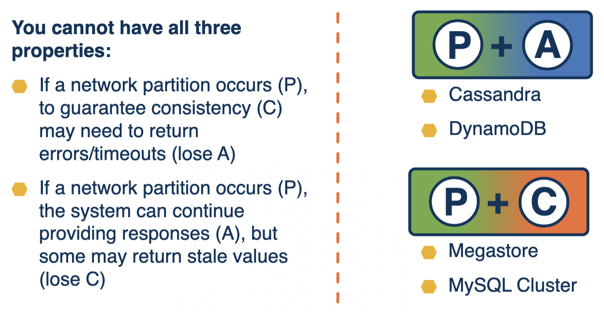

# Introduction to Distributed Systems

## What is a Distributed System?
>"A distributed system is one in which the failure of a computer you didn't even know existed can render your own computer unusable." -Leslie Lamport
- A collection of computing units that interact by exchanging messages via an interconnection network and appear to external users as a single coherent computing facility

## Importance of a Model
- Is a model good enough?
  - **Accurate** - is it possible to learn real truths of the system using the model?
  - **Tractable** - is analysis of a certain problem possible with the model?
- When defining or picking a model, it's important to understand:
  - What **type of problems** does it let us investigate?
  - Will it allow us to **build and analyze solutions** for these problems?
- Examples:
  - Build basic algorithms considering simple applications and their actions
  - All messages will be delivered
  - No messages will be reordered
  - No malicious actors

## What's Hard About Distributed Systems?

### The 8 Fallacies of Distributed Systems
1.  The network is reliable
2.  Latency is zero
3.  Bandwidth is infinite
4.  The network is secure
5.  Topology doesn't change
6.  There is one administrator
7.  Transport cost is zero
8.  The network is homogeneous

## Properties of a Distributed System
- **Fault-Tolerant** - it can recover from component failures without performing incorrect actions
- **Highly Available** - it can restore operations, permitting it to resume providing services even when some components have failed
- **Recoverable** - failed components can restart themselves and rejoin the system after the cause of a failure has been repaired
- **Consistent** - the system can coordinate actions by multiple components often in the presence of concurrency and failure
- **Scalable** - it can operate correctly even as some aspect of the system is scaled to a larger size
- **Predictable Performance** - the ability to provide desired responsiveness in a timely manner
- **Secure** - the system authenticates access to data and services

### What Do We Want From a Distributed System?

## CAP Theorem

- Availability vs. Consistency == Latency vs. Consistency
