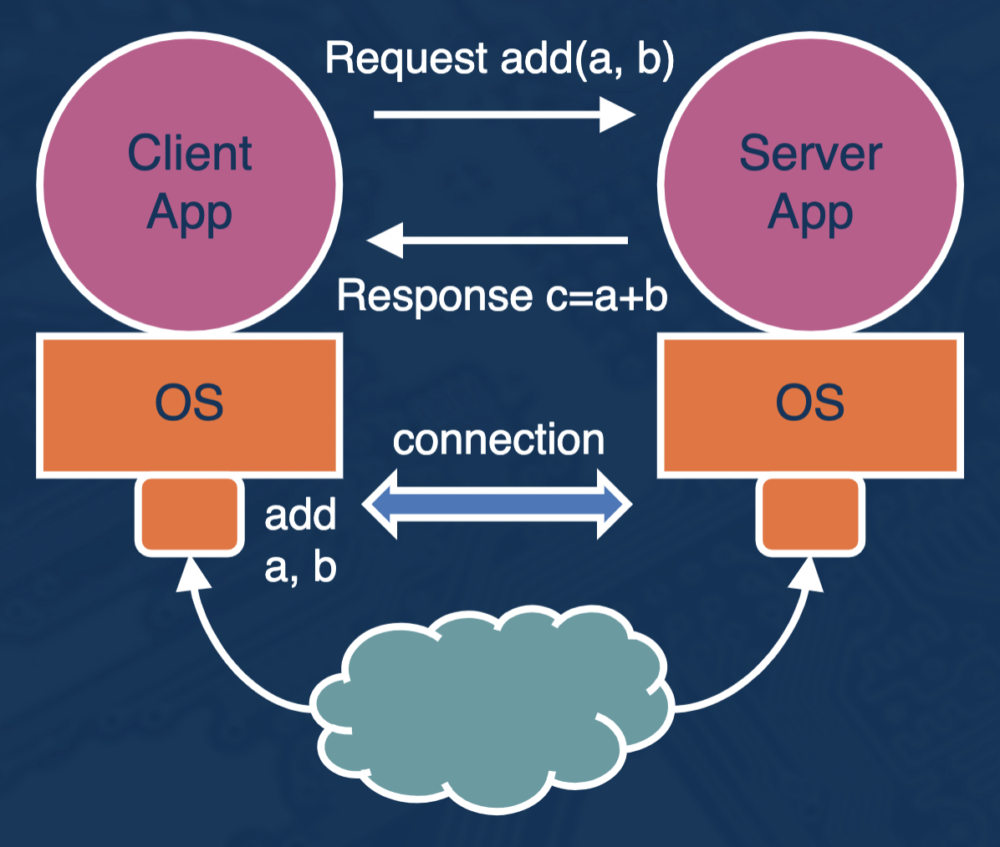
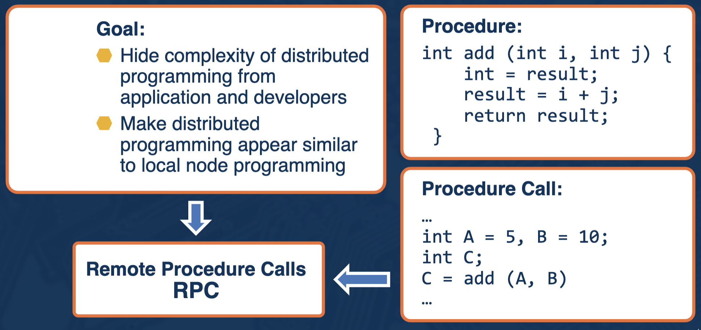
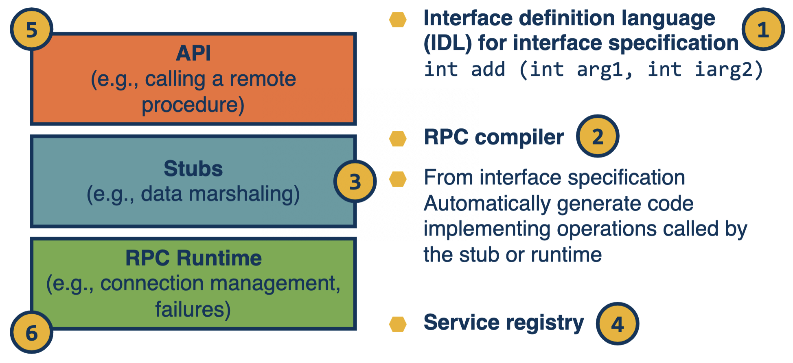
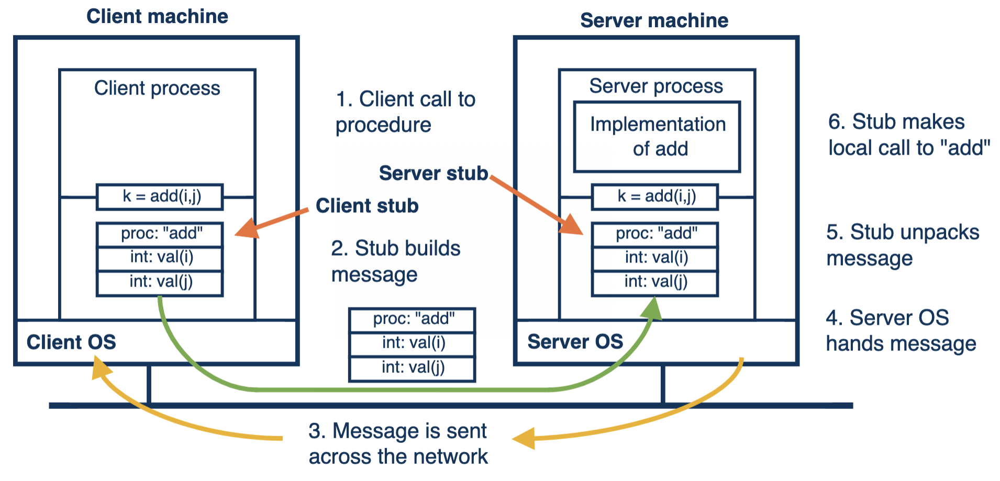
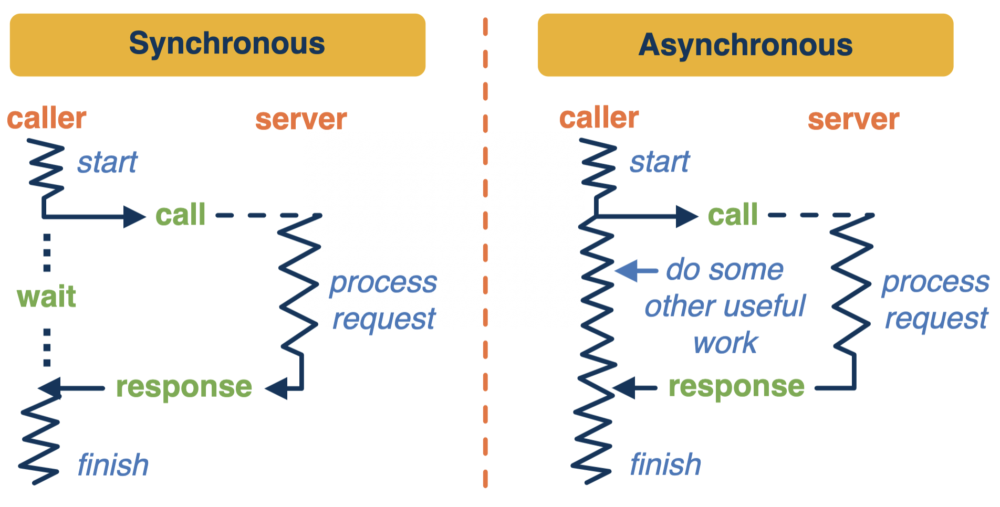

# A Primer on Remote Procedure Calls

## Client-Server Architecture


## What is Hard in Client-Server Systems?
- Discovery and binding
- Identifying the interface and parameter types
- Agreeing on the data representation
- Explicit data management
- Unpredictable delays
- Unknown cause of failures
- Must be explicitly handled

## Goals of an RPC System


## Role of RPC
- Service registration mechanism
- Connection management
- Interface specification
- Type system
- Data management
  - Serialization (marshaling) and deserialization (unmarshaling)
  - Serialized byte stream combines service descriptors (metadata) + arguments or results (data)
- Dealing with failures
  - Timeout and retry for transient
  - Timeout and return appropriate error messsage otherwise

## Architecture of an RPC System


## Anatomy of an RPC Call


## Invocation Semantics of RPC Operations


- **Local PC**
  - No response == deadlock or full process failure
  - Has to restart and redo everything
- **RPC**
  - No response == ?
    - Request lost
    - Response lost
    - Server failure

### RPC Semantics
- **Exactly Once**
  - Timeout and retransmit
  - Eliminate duplicates
  - On persistent failure of server connections (blocks/failures/etc.)
- **At Most Once**
  - Timeout and retransmit
  - Eliminate duplicates
  - Client knows call may not be executed and can be programmed for that
- **At Least Once**
  - Timeout and retransmit
  - No guarantee that duplicates will be eliminated

## Examples of RPC Systems
- Examples:
  - Sun RPC
  - SOAP
  - CORBA
  - Apache Thrift
  - gRPC
- There are also specialized implementations for certain contexts
  - High-speed, reliable networks (high-end data center systems)
  - Low resource footprints (embedded)

### [gRPC](https://grpc.io/)
- Relies on **Protocol Buffers** to provide functionality to describe the interface and data types
- Interface specification: `.proto`
- Compiled using a `protoc` compiler
- API

#### Interface Specification
```grpc
// The greeting service definition.
service Greeter {
  // Sends a greeting
  rpc SayHello (HelloRequest) returns (HelloReply) {}
  // Sends another greeting
  rpc SayHelloAgain (HelloRequest) returns (HelloReply) {}
}

// The request message containing the user's name.
message HelloRequest {
  string name = 1;
}

// The response message containing the greetings
message HelloReply {
  string message = 1;
}
```

#### Server Functions
```java
private class GreeterImpl extends GreeterGrpc.GreeterImplBase {

  @Override
  public void sayHello(HelloRequest req, StreamObserver<HelloReply> responseObserver) {
    HelloReply reply = HelloReply.newBuilder().setMessage("Hello " + req.getName()).build();
    responseObserver.onNext(reply);
    responseObserver.onCompleted();
  }

  @Override
  public void sayHelloAgain(HelloRequest req, StreamObserver<HelloReply> responseObserver) {
    HelloReply reply = HelloReply.newBuilder().setMessage("Hello again " + req.getName()).build();
    responseObserver.onNext(reply);
    responseObserver.onCompleted();
  }
}
```

#### Making a gRPC Call
```java
public void greet(String name) {
  logger.info("Will try to greet " + name + " ...");
  HelloRequest request = HelloRequest.newBuilder().setName(name).build();
  HelloReply response;
  try {
    response = blockingStub.sayHello(request);
  } catch (StatusRuntimeException e) {
    logger.log(Level.WARNING, "RPC failed: {0}", e.getStatus());
    return;
  }
  logger.info("Greeting: " + response.getMessage());
  try {
    response = blockingStub.sayHelloAgain(request);
  } catch (StatusRuntimeException e) {
    logger.log(Level.WARNING, "RPC failed: {0}", e.getStatus());
    return;
  }
  logger.info("Greeting: " + response.getMessage());
}
```
