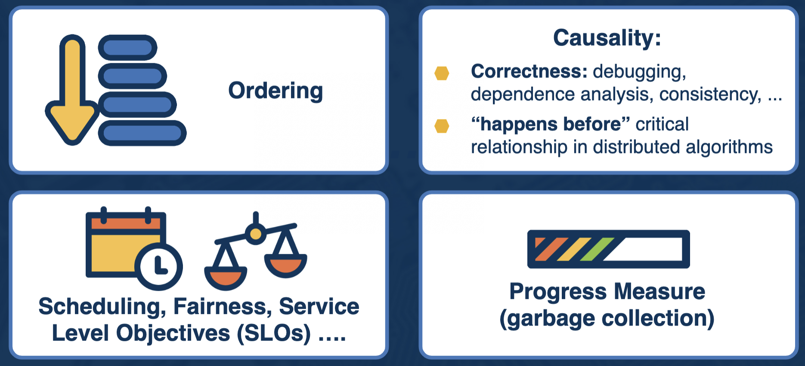
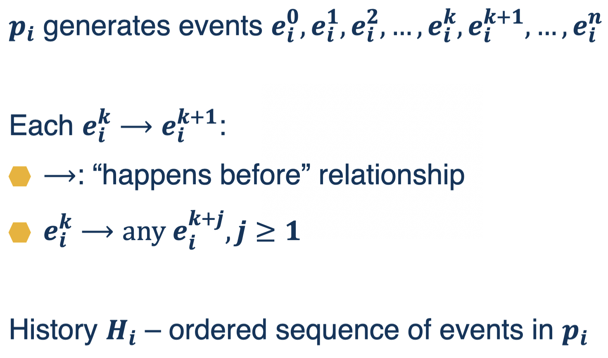
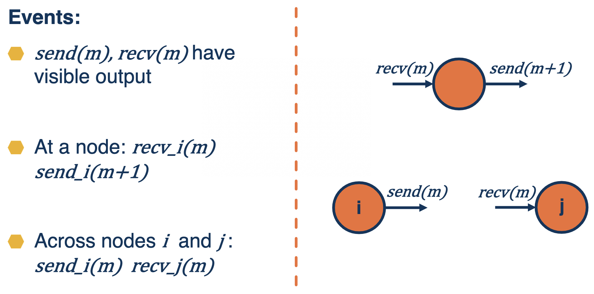
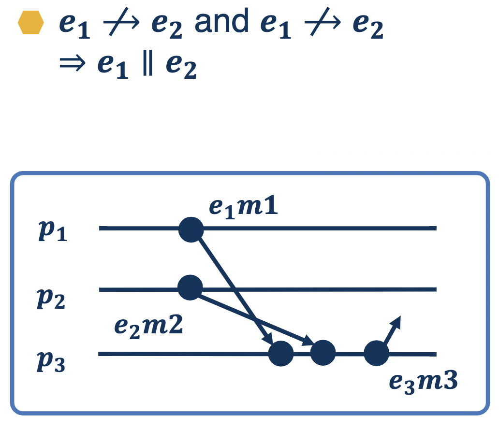
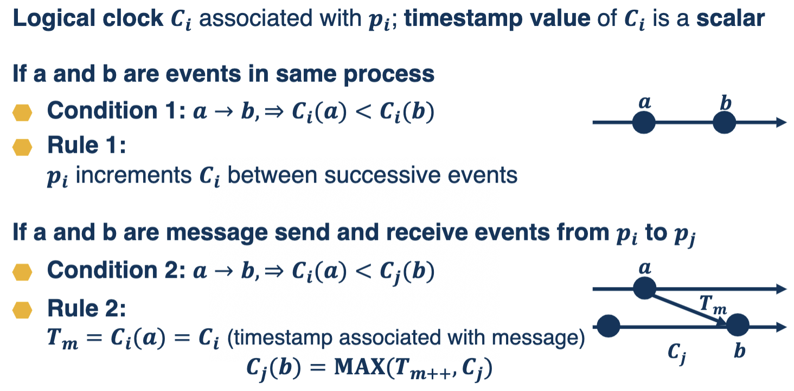
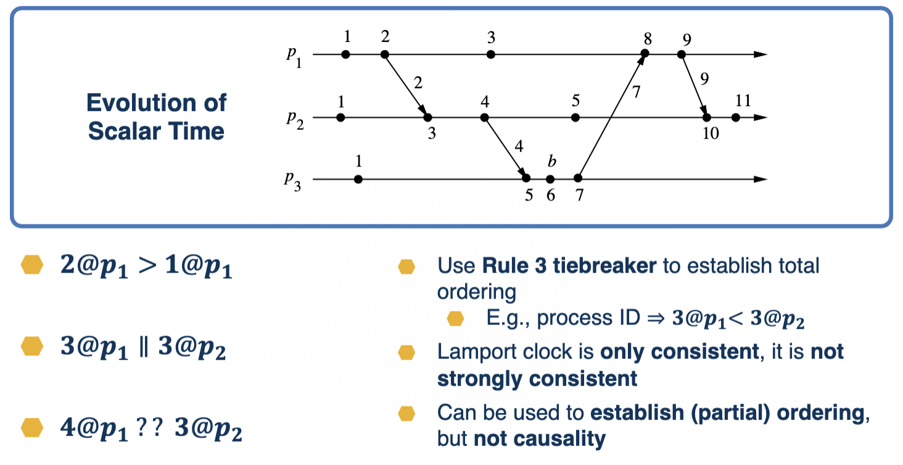
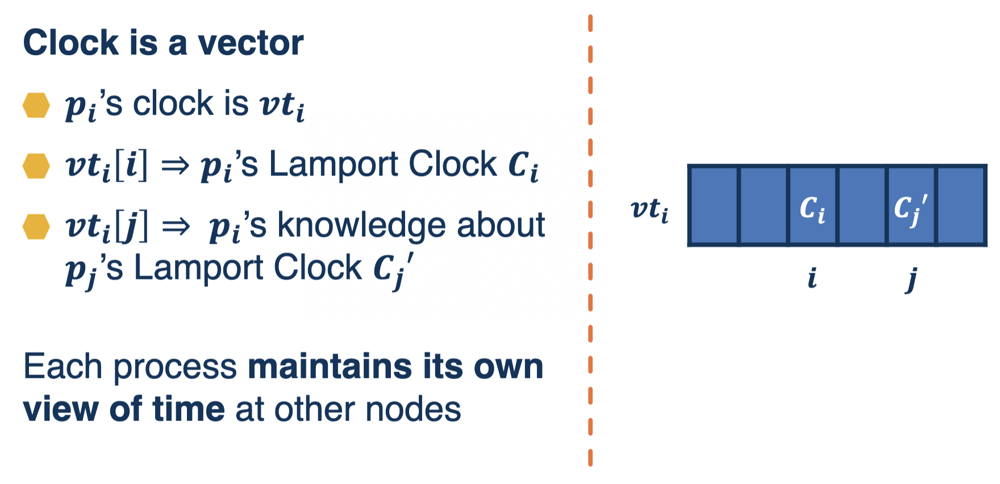
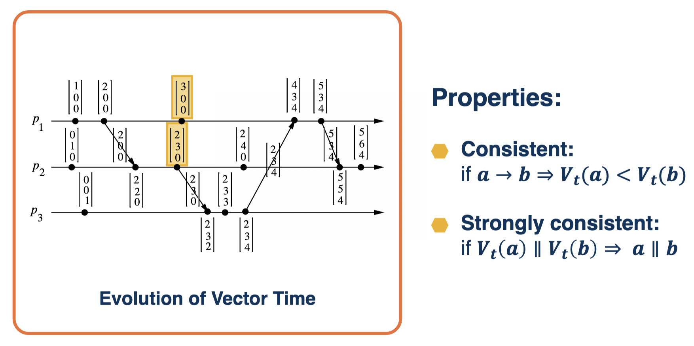
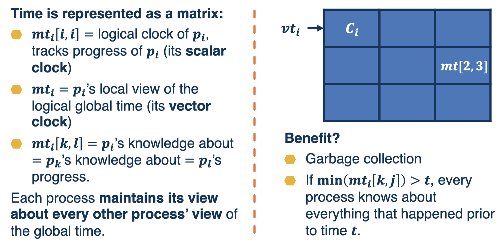

# Time in Distributed Systems

## Why Do We Need Time?

## Why Is Measuring Time Hard in Distributed Systems?
- Do all nodes *need to agree* on what the global time is?
- Are message propagation *times fixed for all messages/connections*?
- Are *delays constant*?
- Are there *failures*?  Of a node?  Of a network connection?
- Are there any *malicious nodes*?

## Logical Time
- *Real time* measured with real clocks is hard to work with
  - The solution is to introduce *virtual time* measured with *virtual clocks*
- **Logical clocks and logical time**
  - Generate timestamps
  - Advance in some manner
  - Can be used to order events

### Types of Logical Time
- Scalar (Lamport's) clocks
- Vector clocks
- Matrix clocks

## Common Notations

## Concurrent Events

## Logical Clock
- For each *event 𝒆𝟏*, *Logical Clock 𝑪* produces *timestamps 𝑪(𝒆𝟏)*
- **Clock Consistency Condition**
  - If 𝒆𝟏⟶𝒆𝟐 ⇒ 𝑪(𝒆𝟏)<𝑪(𝒆𝟐)
    - Monotonicity property
- **Strong Clock Consistency**
  - 𝒆𝟏⟶𝒆𝟐 ⇒ 𝒆𝟏 ⟺ 𝑪(𝒆𝟏)<𝑪(𝒆𝟐)

### Logical Clock (Formal Definition)
For any event in the distributed system, **logical clock 𝑪(𝒆) produces a value in 𝑻**
  - The timestamp, a data structure
**Map event history to partially ordered time domain 𝑻**
  - Since events may be concurrent
**A clock function 𝑪**
  - A set of rules to advance timestamps (to increment the clock)

## Lamport's Scalar Clock
- Each node has it's own implementation of the clock which executes the clock rules to produce a new timestamp

### Illustration of Lamport's Clock

- Bonus feature: ~counting, estimate of # of events
- If increment is **always by 1 ⇒ local clock = minimum number of preceding events** in the distributed system

### Summary of Lamport's Clock
- **Is consistent**
  - 𝒆𝟏⟶𝒆𝟐 ⇒ 𝑪(𝒆𝟏)<𝑪(𝒆𝟐)
  - Sufficient for correctness
- **Is not strongly consistent**
  - 𝑪(𝒆𝟏)<𝑪(𝒆𝟐)!⇒ 𝒆𝟏⟶𝒆𝟐
  - Some loss of efficiency

## Vector Clock

### Comparison
 Property | Lamport/Scalar | Vector
--- | --- | ---
Correctness | Clock consistency | Clock consistency
Efficiency | Not strongly consistent | Strongly consistent
Clock Size | O(1) | O(N)

## Matrix Clock

