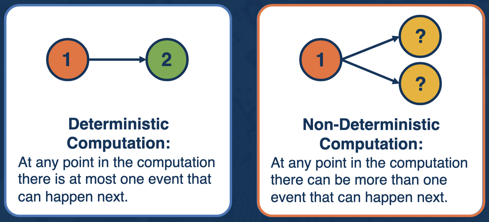
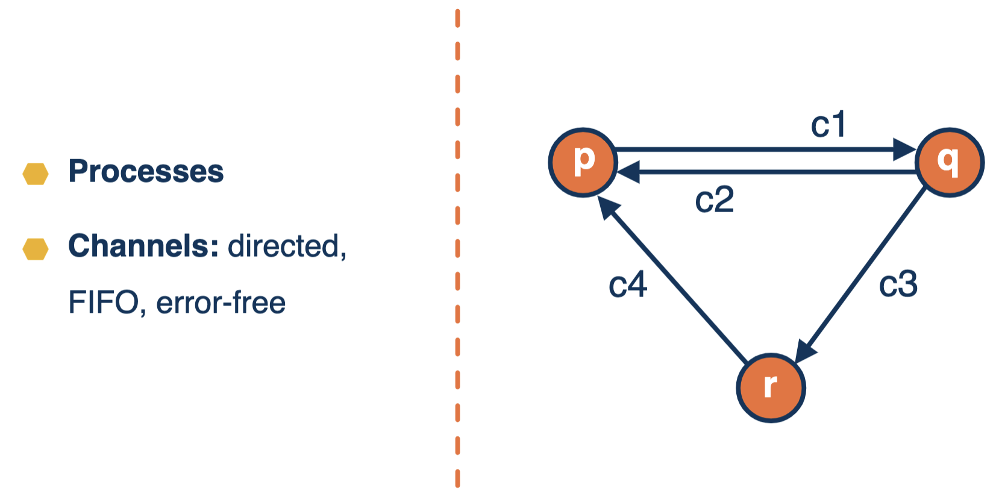
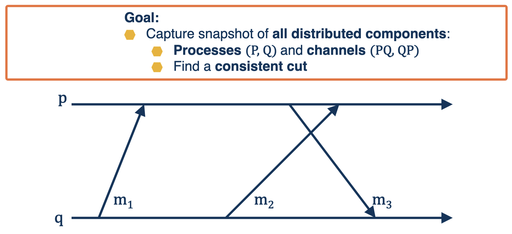
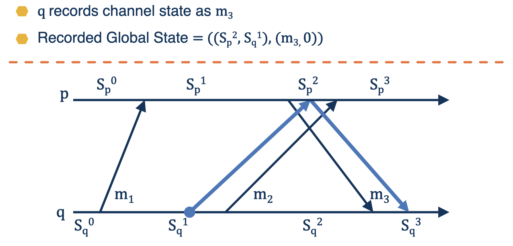
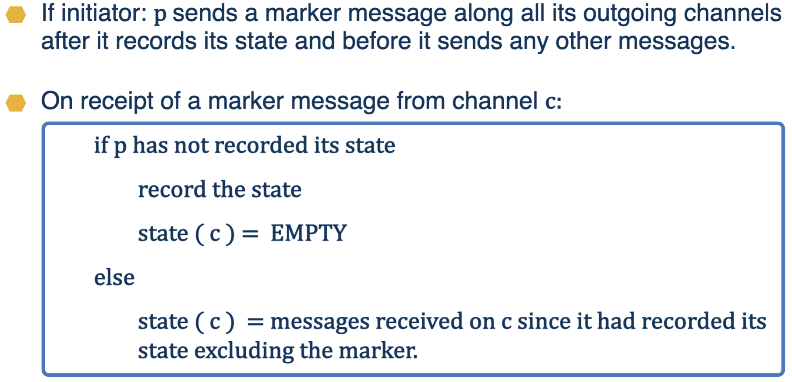
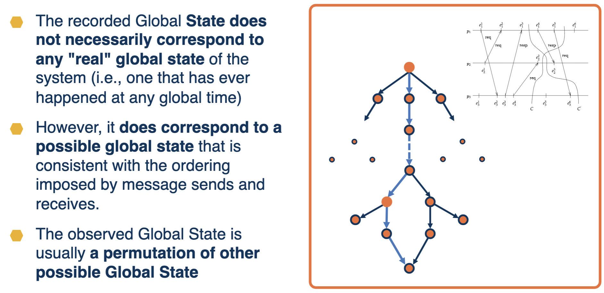
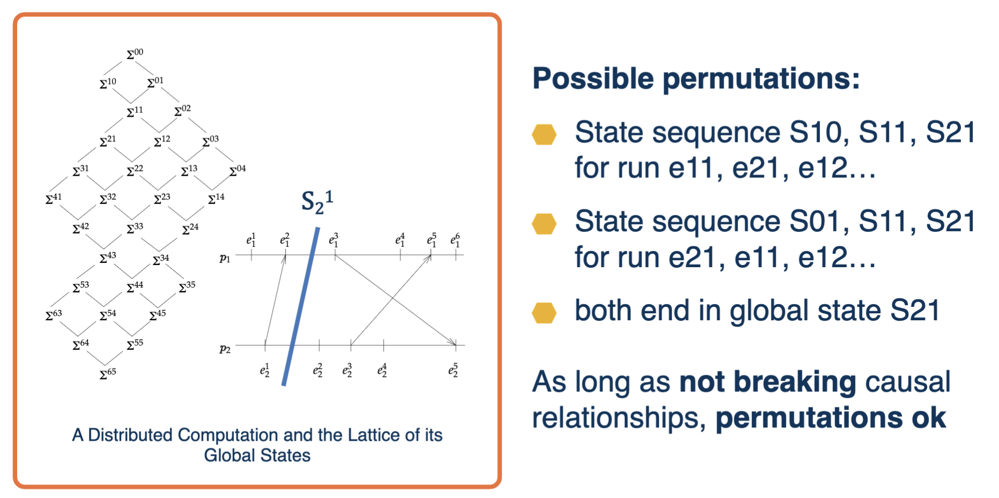
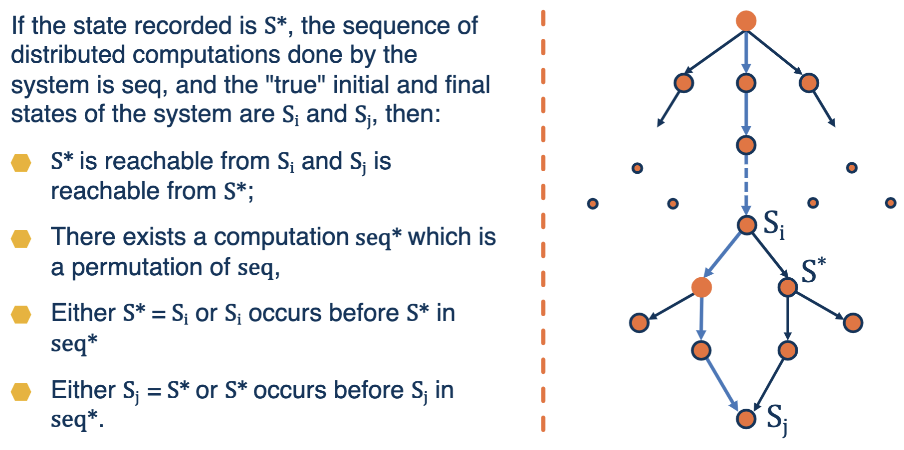
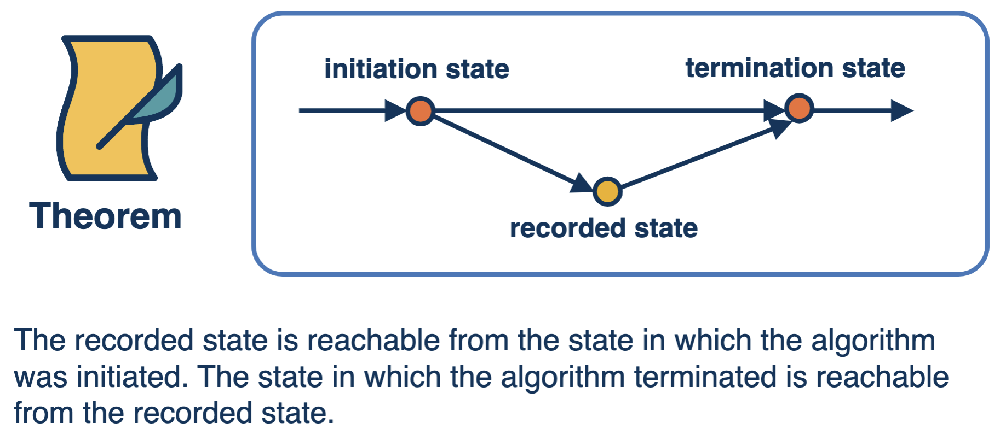
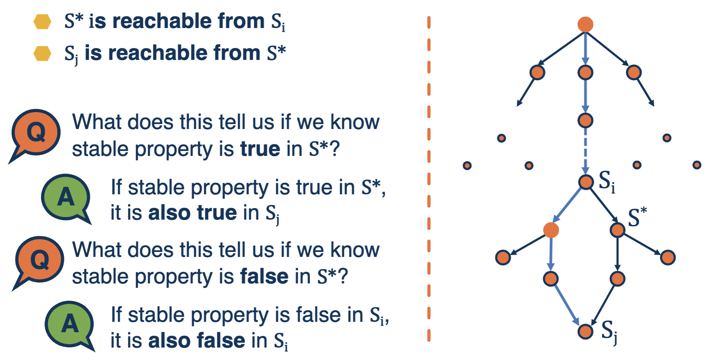

# State in Distributed Systems

## Terminology
- **Global State**
  - Processes and channels
  - Process state defined by most recent event
  - Channel state defined by inflight messages
- **State transitions**: each event changes the state of at least one of the entities, therefore changing the state of the distributed system

## Challenges Surrounding State in Distributed Systems
- Instantaneous recording not possible
- No global clock
- Random network delays

### Difficulties Due to Non-Determinism

## System Model

## Finding a Consistent Cut

### Algorithm in Action
- q records state as Sq1, sends marker to p
- p records state as Sp2, channel state as empty

## Snapshot Algorithm
- **Initiator**
  - Save its local state
  - Send marker tokens on all outgoing edges
- **All other processes**
  - On receiving the first marker on any incoming edge:
    - Save state, and propagate markers on all outgoing edges
    - Resume execution, but also save incoming messages until a marker arrives through the channel
- **Guarantees a consistent global state!**

### Assumptions of the Algorithm
- There are no failures and all messages arrive intact and only once
- The communication channels are unidirectional and FIFO ordered
- The snapshot algorithm does not interfere with the normal execution of the processes
- Each process in the system records it's local state and the state of it's incoming channels

### A Brief Sketch of the Algorithm

## Global State

### Chandyand Lamport Algorithm
- Does not promise to give us exactly what is there
- But gives us consistent state

### Properties of the Recorded Global State

### Permutation of a Run

## Properties of a Global State

## Benefits of Global State
- **Stable Properties Detection**
  - A property is called a stable property if and only if it becomes true in a state S and remains true for all states S’ reachable from S
  - For example: Deadlock, Termination, Token loss
- Challenge: evaluate a property without knowing/being sure of system state?

## Definite vs. Possible State
- **Unstable properties**
  - Examples: temporary buffer overflow, load spike, race condition, etc.
  - StateS * may not have occurred
- For **stable** property y, if y(S*) = true → **definitely is true**
- For **unstable** property y, if y(S*) = true → **possibly could be true** under some conditions

## Summary
- Global State detection is difficult in distributed systems
- Algorithm for capturing distributed snapshots corresponding to a possible global state
- Snapshot algorithm may not give an actual statebut is very helpful in detecting stable properties
