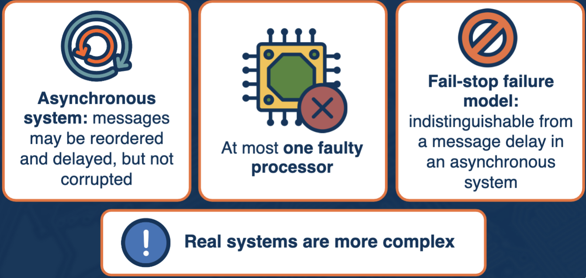

# Consensus in Distributed Systems

## What is Consensus?
- Agreement among distributed processes
  - On a value, action, timestamp, etc.
  - On the outcome of a transaction
- Reaching a consensus makes it possible for the system to be correct
- Non-trivial for reasons related to non-determinism, lack of global clock, network delays, malicious behavior, etc.

### Key Properties
1.  All non-faulty processes eventually decide on a value (termination/liveness)
2.  All processes decide on a single value (agreement/safety)
3.  The value that's decided on must have been proposed by some process (validity/safety)

## System Model

- If consensus is not possible in this simple system, it will not be possible in a more complex system (where messages can be corrupt, more processors are faulty, or Byzantine failures are possible)

## Definitions
- **Admissible run** – run with 1 faulty processor and all messages eventually delivered (matches system model)
- **Deciding run** - admissible run where some non faulty processors reach a decision
– **Totally correct consensus protocol** – if all admissible runs are also deciding runs
- **Univalent configuration** – when a system reaches a single decision
- **Bivalent configuration** – multiple/two decisions possible (non-deciding)

## FLP Theorem
- In a system with one fault, no consensus protocol can be totally correct

### Idea of the Proof
- System with asynchronous communication, 1 faulty process, fail-stop model
- It is possible to identify a configuration and a run where the system will not reach a deciding state?
- Can you have at least one admissible schedule (1 faulty processor and all messages delivered) which is not a deciding schedule (the system remains in a bivalent configuration)?

### Proof in a Nutshell
- **Start** with a system where nodes are capable of making one of two decisions, 0 or 1
- **#1: Lemma 2**: There is an initial configuration for which the final decision is not predetermined, but depends on the schedule of events ⟹ there must exist an initial bivalent configuration
- **#2**: A bivalent system must go through a step (a message being delivered) which changes it to univalent in order to make a decision
- **#3**: It is possible to delay/reorder messages in such a way so that the system never goes through a bivalent → univalent configuration change
- ⟹ in a system where 1 faulty node is possible and messages may be delayed and reordered, there will always be an initial bivalent state, in which an admissible non-deciding schedule can exist 

## Is Consensus Really Impossible?
- Faults are inevitable
- Network delays are a given
- ⟹ can't expect a stronger system model
- FLP ⟹ Cannot have a correct distributed system

### Not So Fast... A Look at Different Consensus Protocols
- Different consensus protocols: 2PC, 3PC, Paxos, Raft
- Do not contradict FLP result
- Change some of the initial assumptions and system properties
  - Allow us to achieve consensus, but further specify conditions under which the protocol will terminate, provide consensus, etc.

## Summary
- Can a distributed system always be guaranteed to be able to reach a consensus?
  - FLP Theorem proves that systems with 1 faulty processor and reordered and arbitrarily delayed messages, it is impossible to guarantee that a consensus is reached
