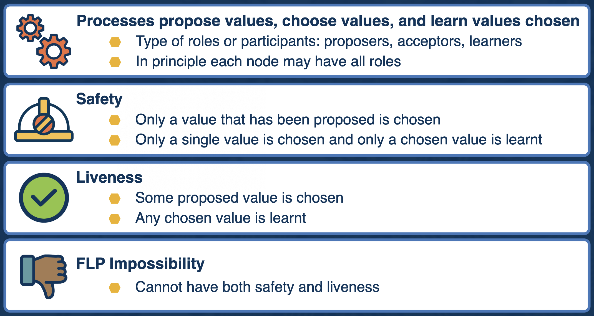
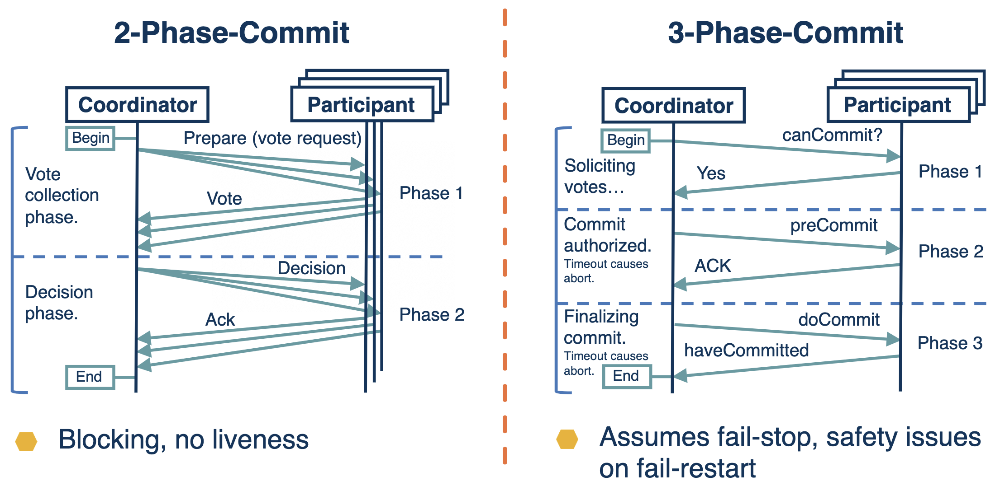
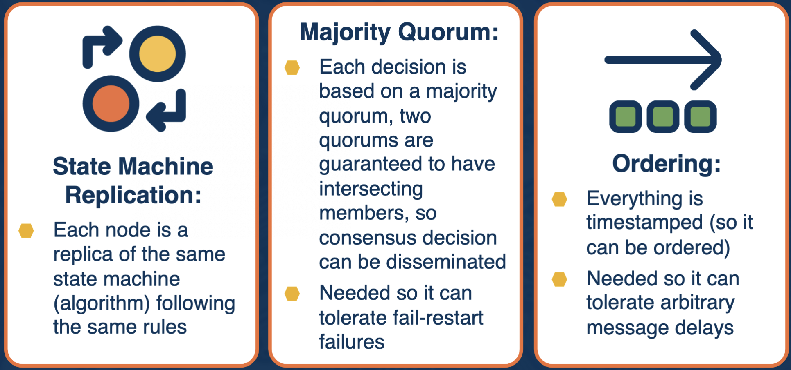
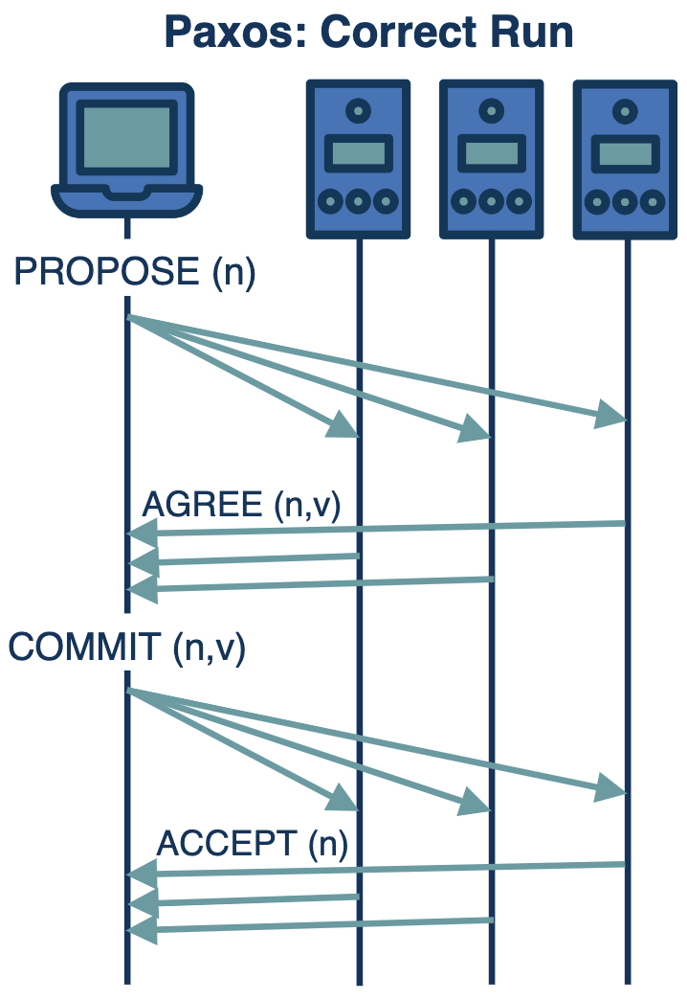
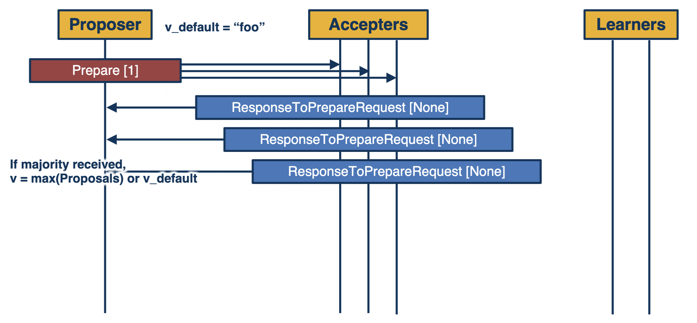
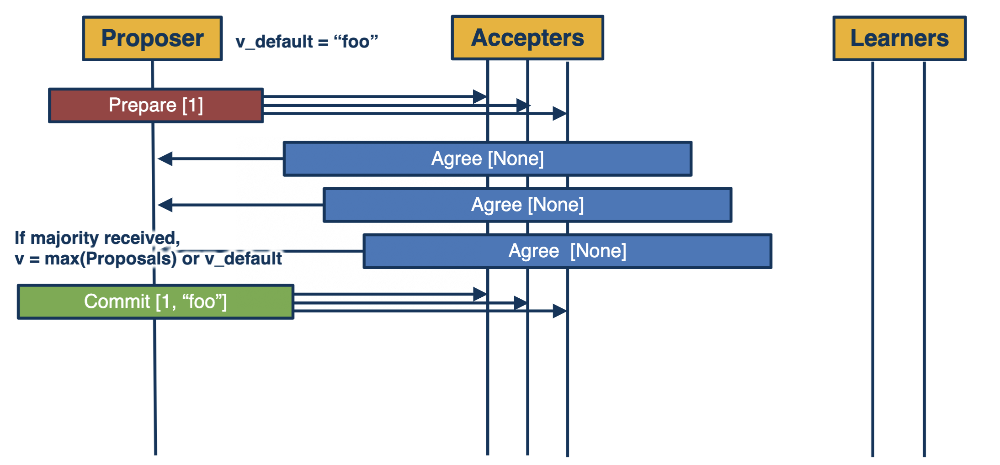
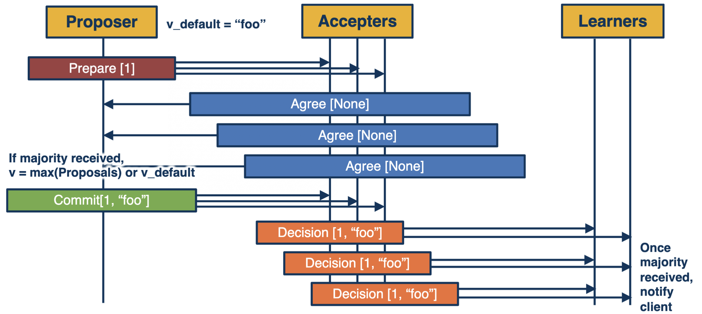
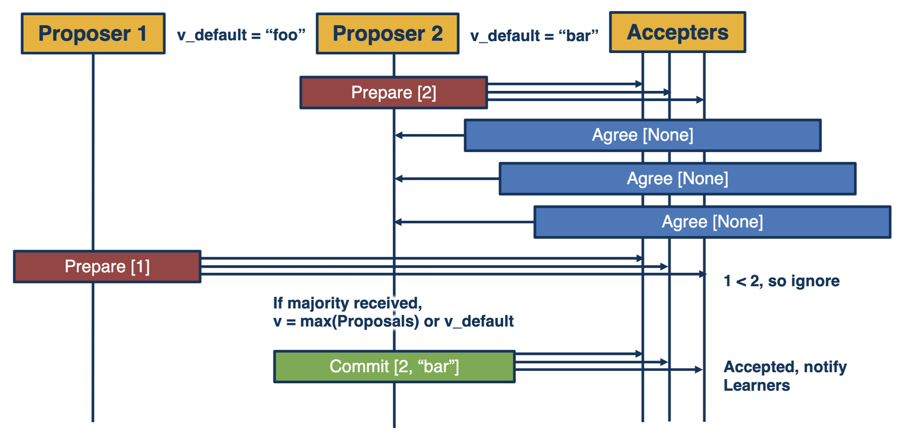
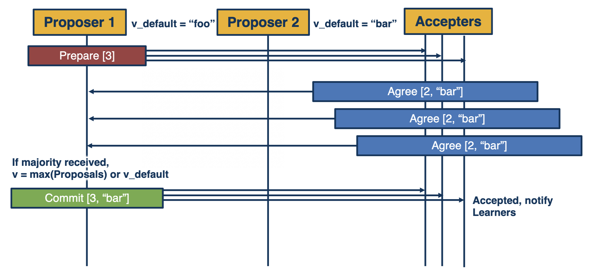

# Paxos and Friends

## Consensus Protocol Goals

## 2-Phase-Commit (2PC) and 3-Phase-Commit (3PC)

### 2-Phase-Commit (2PC)
- Coordinator assumed not to fail
- Coordinator proposes a value that all participants must agree upon
- Blocks if there are failures (doesn't guarantee liveness)

### 3-Phase-Commit (3PC)
- Addresses the blocking problem in 2PC
- Only works with a fail-stop
  - Assumes that if a node failes, it won't restart
  - If a message is delayed past timeout, it won't be delivered later

## Paxos Made Simple

### Assumptions (System Model)
- **Asynchronous, non-Byzantine model**
  - Agents operate at arbitrary speed, may fail by stopping, and may restart
  - Agents have source of persistent memory to remember information after restarting
  - Messages can take arbitrarily long to be delivered, can be duplicated, lost, or reordered, but cannot be corrupted

### Underpinning Ideas

### Phases
- **3 Phases:**
  1.  **Prepare** - node proposes and agreement round
  2.  **Accept** - gather votes whether an agreement is possible and value has been agreed upon
  3.  **Learn** - agreed upon value can be learned by all
- Possible to learn in 2 message rounds
- Proposal number included as part of messages
  - Solves fail-restart and delayed messages

#### Prepare Phase
1.  Driven by proposer (the leader)
2.  A proposer selects a proposal number nand sends a prepare request with the number `n` to a majority of acceptors. The number `n` is a member of a set that is totally ordered over all processes (no two processes use the same nand a process never uses `n` twice).
3.  If an acceptor receives a prepare request with `n` greater than that of any prepare request to which it has already responded, it responds with promise not to accept any more proposals numbered less than `n` and with the highest-numbered proposal (if any) that it has accepted.

#### Accept Phase
1.  If a proposer hears back from a majority of acceptors, it sends an accept request to each of those acceptors for proposal numbered `n` with value `v`.  `v` is the value of the highest-numbered proposal among the responses.  If there were no proposals, the proposer can choose `v`.
2.  If an acceptor receives an accept request for a proposal numbered `n`, it accepts the proposal unless it has already responded to a prepare request with a number greater than `n`.

#### Learn Phase
- Accepted value becomes decided value and is communicated to learners
- Inefficient to have each acceptor notify each learner whenever it accepts a proposal
- Choose a distinguished learner that receives accepted proposals from the acceptors
- Once distinguished learner receives a proposal from a majority of acceptors, it informs the other learners

### Corner Cases

