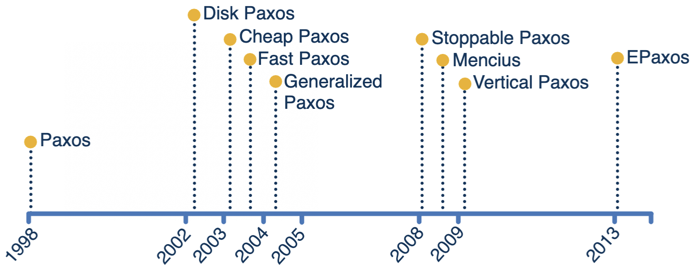
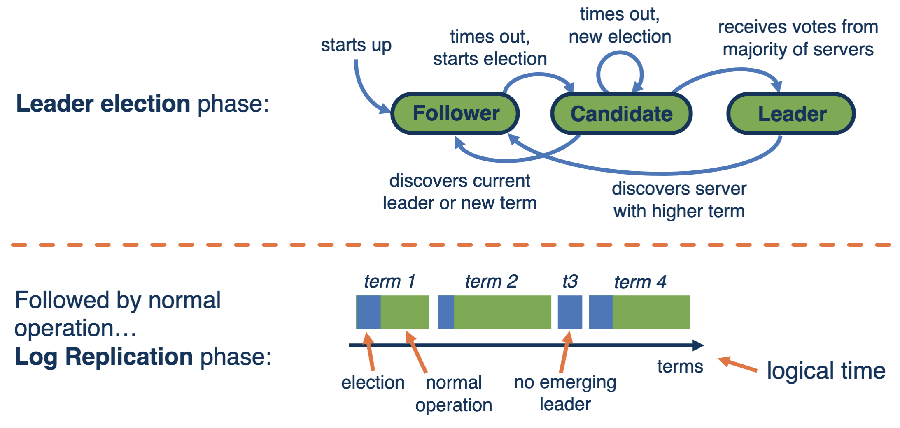
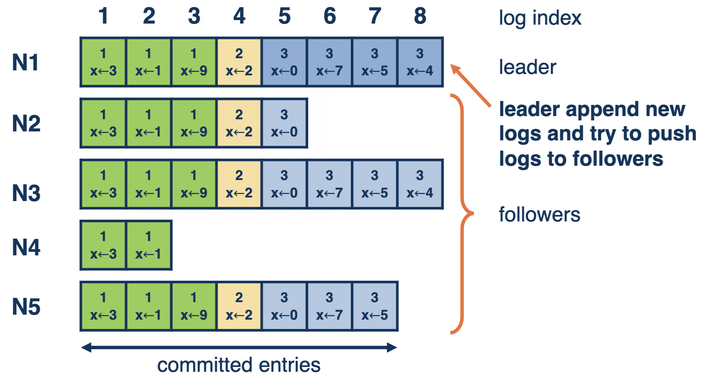
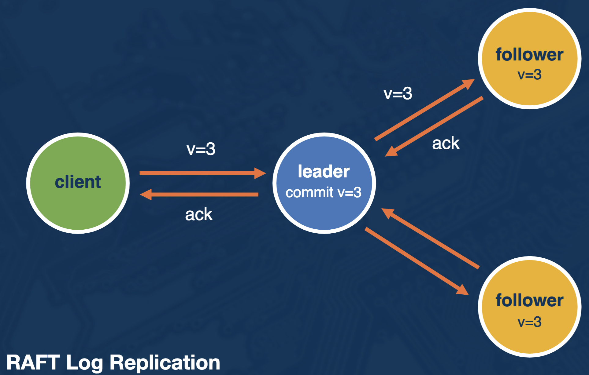

# Paxos and Friends

## Consensus Protocol Goals

## 2-Phase-Commit (2PC) and 3-Phase-Commit (3PC)

### 2-Phase-Commit (2PC)

- Coordinator assumed not to fail
- Coordinator proposes a value that all participants must agree upon
- Blocks if there are failures (doesn't guarantee liveness)

### 3-Phase-Commit (3PC)

- Addresses the blocking problem in 2PC
- Only works with a fail-stop
  - Assumes that if a node failes, it won't restart
  - If a message is delayed past timeout, it won't be delivered later

---

## Paxos Made Simple

### Assumptions (System Model)

- **Asynchronous, non-Byzantine model**
  - Agents operate at arbitrary speed, may fail by stopping, and may restart
  - Agents have source of persistent memory to remember information after restarting
  - Messages can take arbitrarily long to be delivered, can be duplicated, lost, or reordered, but cannot be corrupted

### Underpinning Ideas

### Phases

- **3 Phases:**
  1.  **Prepare** - node proposes and agreement round
  2.  **Accept** - gather votes whether an agreement is possible and value has been agreed upon
  3.  **Learn** - agreed upon value can be learned by all
- Possible to learn in 2 message rounds
- Proposal number included as part of messages
  - Solves fail-restart and delayed messages

#### Prepare Phase

1.  Driven by proposer (the leader)
2.  A proposer selects a proposal number nand sends a prepare request with the number `n` to a majority of acceptors. The number `n` is a member of a set that is totally ordered over all processes (no two processes use the same nand a process never uses `n` twice).
3.  If an acceptor receives a prepare request with `n` greater than that of any prepare request to which it has already responded, it responds with promise not to accept any more proposals numbered less than `n` and with the highest-numbered proposal (if any) that it has accepted.

#### Accept Phase

1.  If a proposer hears back from a majority of acceptors, it sends an accept request to each of those acceptors for proposal numbered `n` with value `v`. `v` is the value of the highest-numbered proposal among the responses. If there were no proposals, the proposer can choose `v`.
2.  If an acceptor receives an accept request for a proposal numbered `n`, it accepts the proposal unless it has already responded to a prepare request with a number greater than `n`.

#### Learn Phase

- Accepted value becomes decided value and is communicated to learners
- Inefficient to have each acceptor notify each learner whenever it accepts a proposal
- Choose a distinguished learner that receives accepted proposals from the acceptors
- Once distinguished learner receives a proposal from a majority of acceptors, it informs the other learners

### Corner Cases

### Paxos vs. FLP

- **Paxos has a possible liveness problem**
  - Two proposers keep issuing a sequence of proposals with increasing numbers
  - Before the first value is "learned" from a majority, the next value is accepted as a proposal...
  - There is no guarantee it will reach a decision
- **Workaround**
  - Random delays in retrying a new value
  - Designate a "distinguished proposer" (and some timeouts to resolve leader failure)
  - Makes it very unlikely that liveness will not be reached but not impossible ⇒ FLP holds

### Multi-Paxos

- Each "simple" single-decree Paxosf or agreeing on an individual value
- Multiple Paxos protocols executed for agreeing on the order and values of a sequence of operations
- Many inflight exchanges, voting, etc.
- **Optimization**
  - Leader for a current "view" (of a currently active group)
  - All values in that view get accepted and learned per Paxos
  - Make sure to detect and act upon "view" changes

### Paxos in Practice

- http://harry.me/blog/2014/12/27/neat-algorithms-paxos/

---

## RAFT

### Leader Election

- Follower’s timeout triggers a leader election
- One or more candidates
- Includes term number and log index in "candidacy" request
- All nodes vote

#### Leader Election Rules

- **Property 1: Election Safety:** at most one leader in any term
- **Leader Election Rules**
  - **Rule 1:** leader is elected by the majority
    - New terms start, this candidate becomes new leader
  - **Rule 2:** prevent outdated leaders from being elected
    - Servers only vote when the candidate has a newer log
    - New: higher term number or same term number but longer log
    - "Losing" candidate know it is outdated, keep following
  - **Rule 3:** tie in the election/split votes
    - No candidate gets the majority or network partition ⇒ issue new election
    - Random timeout for each server to avoid split votes

### Log Replication

- **Step 1:** leader pushes new log entry along with its previous entry to followers during heartbeats
- **Step 2:** each follower check whether it has the previous log and sends ack if yes
- **Step 3:** log entry gets committed at leader once leader get majority ack, leader then ack client
- Outdated followers catch up through heartbeat

- **Property 2: Leader Append-Only**
- **Property 3: Log Matching:** if 2 entries in different logs share the same index and term number, this entry and all the previous entries are the same
- **Inconsistency:** leader failure before commiting some log entries, new leader is oblivious about the uncommitted log
- **Fix:** new leader forces all other servers to use it's log, the leader election strategy guarantees the new leader knows all the committed logs
- **New leader commits uncommitted logs** in previous terms after it commits some logs in new term

#### Garbage Collection

### Safety

- **Property 4: Leader Completeness:** once committed, log entry won’t be overwritten
- **Property 5: State Machine Safety:** once a log entry is applied in a node, no other node will apply a different log entry in the same slot

### RAFT in Action

- http://thesecretlivesofdata.com/raft/
- https://raft.github.io/
