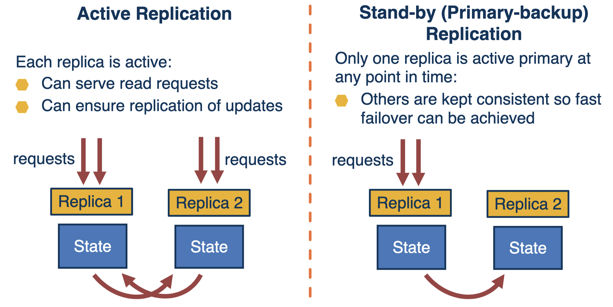
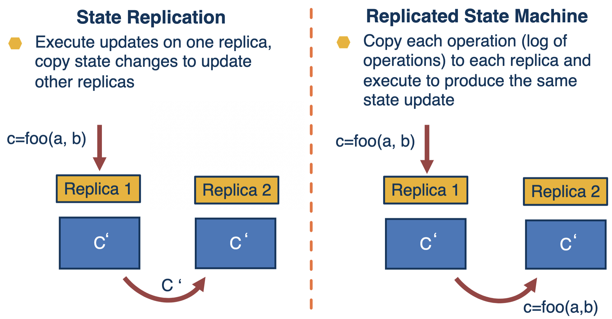
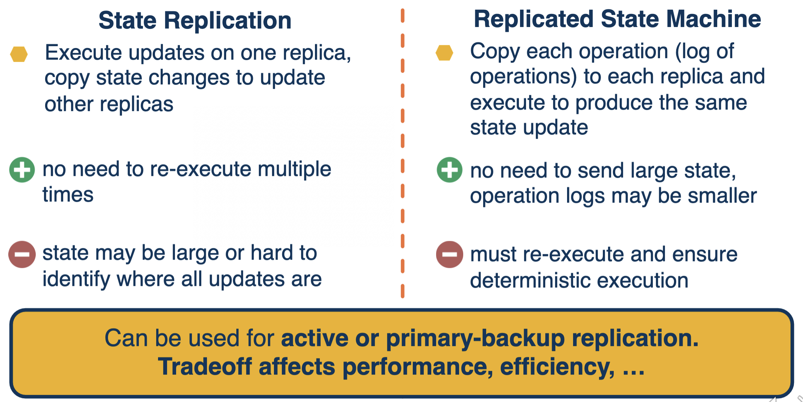
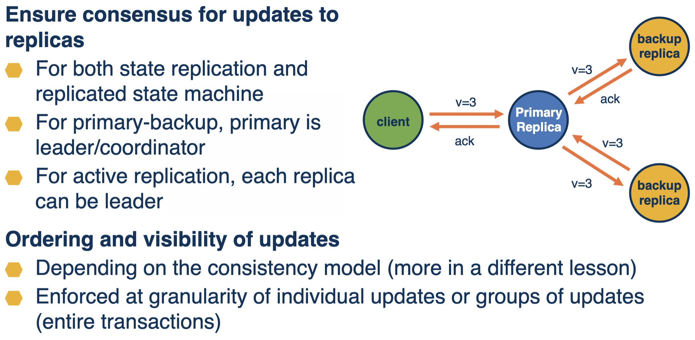
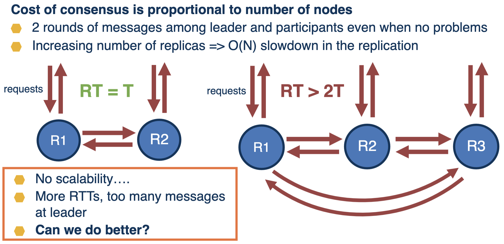
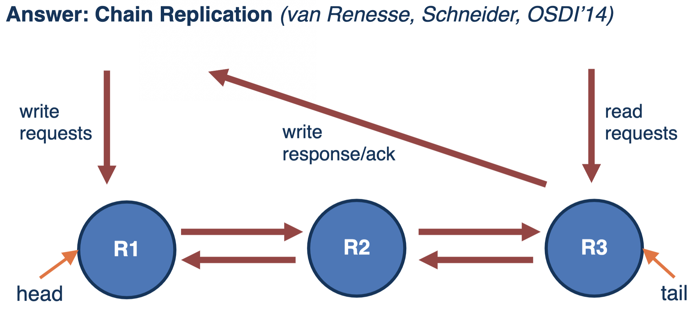
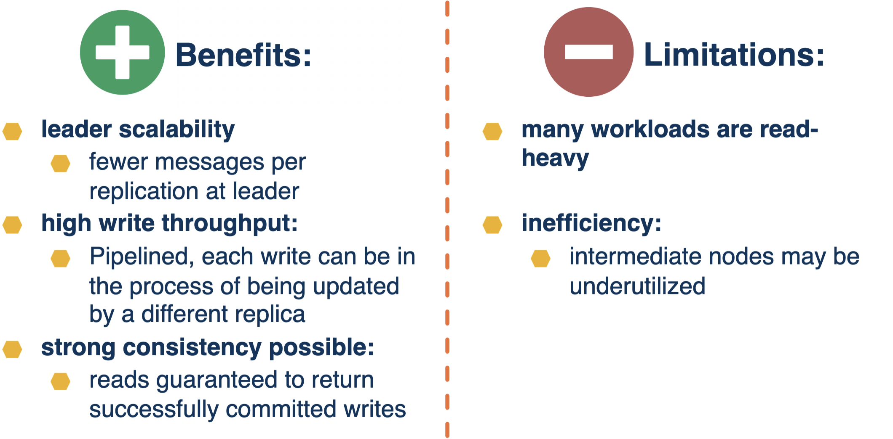
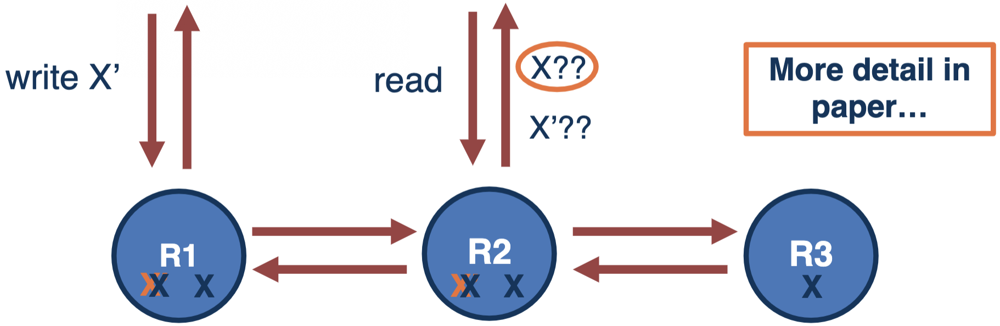
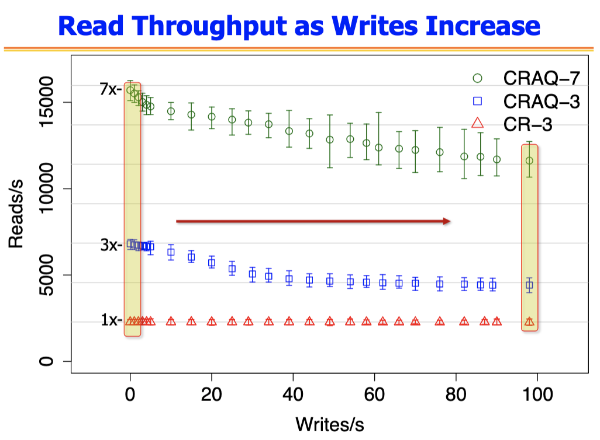

# Replication

## Goal of Replication

- State available at more than one node
- Service can be provided from more than one node
- **Benefits of replication:** fault-tolerance, availability, scalability

## Replication Models

## Replication Techniques

## Replication and Consensus

## Chain Replication

- Read from tail needed for correctness

## CRAQ

- **CR:** reads limited to tail replica only
- **CRAQ: Chain Replication with Apportioned Queries**
  - Apportioned == divided among the chain replicas
  - Queries == read operations
  - Writes continue to be handled by head replica

- Maintain old and new versions of data at each replica
- When both values present, check with tail

## CRAQ vs. CR Scalability

- CRAQ (-3 or -7) can scale to higher read throughput vs. CR, even as the write load increases
- CRAQ throughput scales with the increase of the number of replicas in the chain (CRAQ-7 vs. CRAQ-3)

## Summary

- The right choice depends on:
  - **Workload:** reads, writes
  - **System configuration:** number of nodes, distribution, network properties
  - **Consistency requirements**, failures and fault-tolerance methods
