# Fault Tolerance

## Taxonomy

### From Fault to Failure

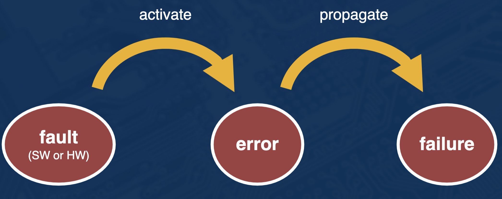

### Types of Failures

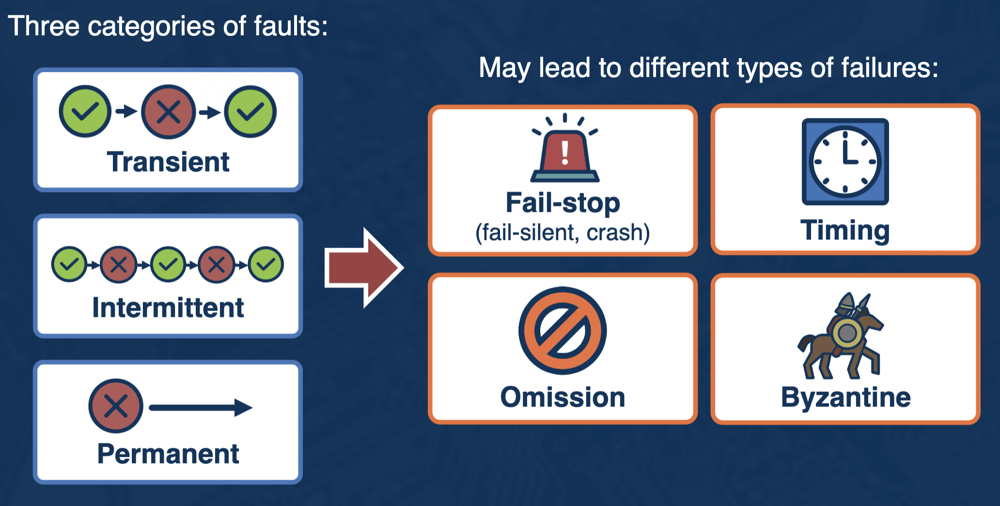

### Managing Failures

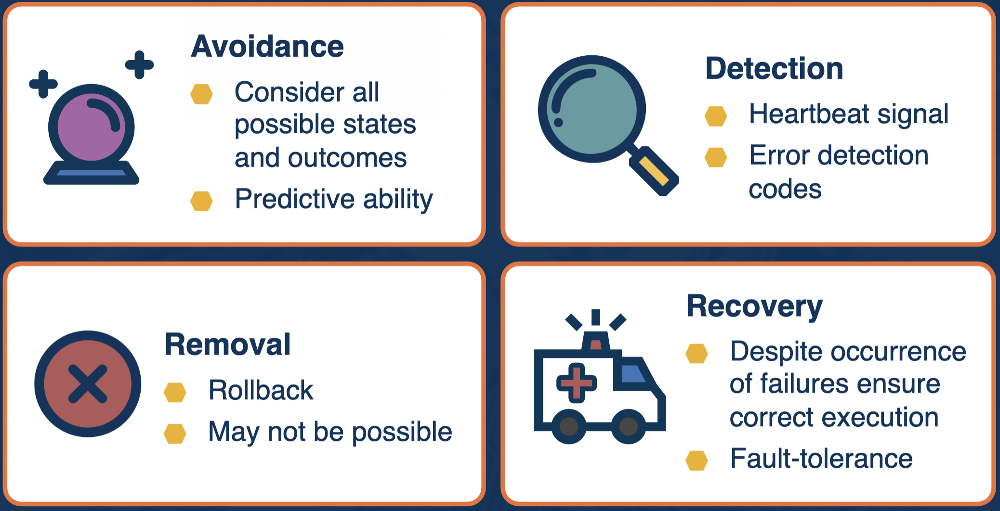

## Rollback-Recovery

- Main Idea
  - If a failure detected
  - Rollback to system state before failure
    - Rollback any effects of exchanged messages
    - Rollback updates to process state
  - Re-execute
- How to capture this state?
  - Try to find by progressively rolling back to earlier consistent cuts
  - Checkpointing
  - Logging

### Granularity at Operation

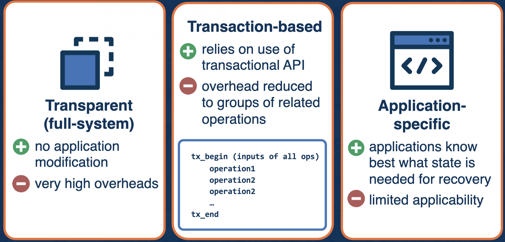

## Basic Mechanisms

### Checkpointing

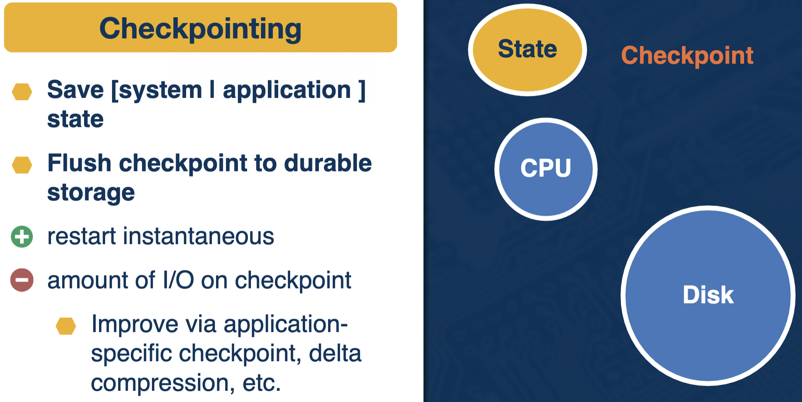

### Logging

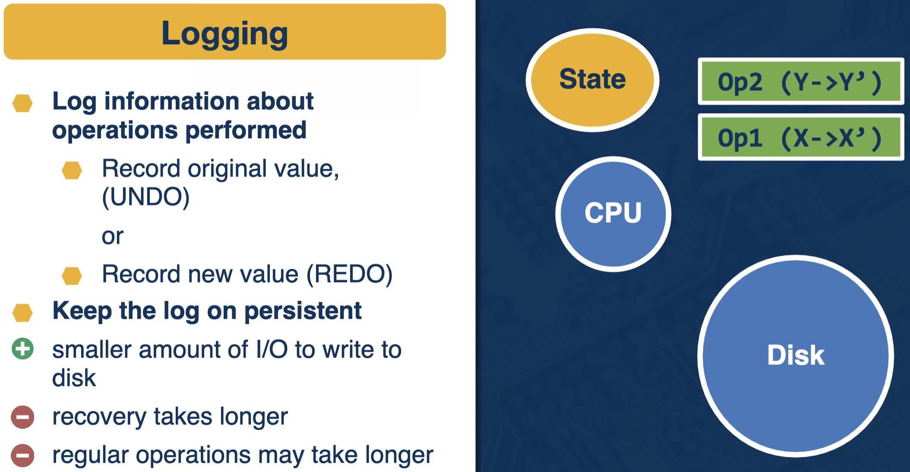

### Checkpoint & Logging

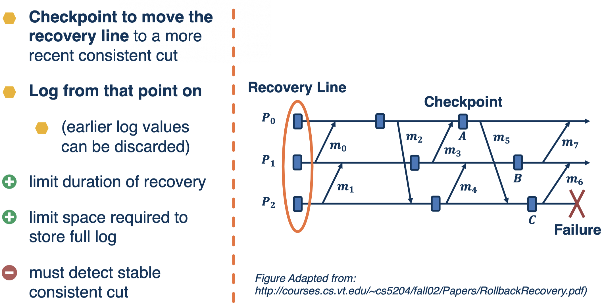

## Checkpointing Approaches

### When to Take a Checkpoint?

- Uncoordinated
- Coordinated
- Communication-induced

### Model

- Fixed number of processors
- Communication only through messages
- Processes interact with the outside world
- Network is non-partitionable but other assumptions vary per protocol:
  - FIFO?
  - Reliable communication channels?
- Number of tolerated failures vary per protocol

## Uncoordinated Checkpointing

- Processes take checkpoints independently
- This means we need to construct a consistent state upon failure
  - Need to calculate the recovery line and rollback to it
  - Need to store dependency information

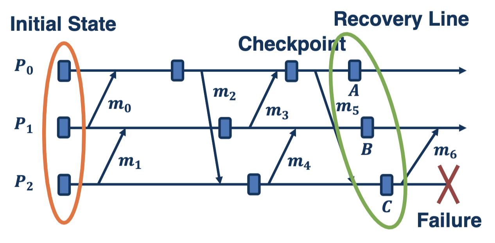

- Danger that consistent cut will roll back the execution to the beginning

### Issues with Uncoordinated Checkpointing

- Domino Effect
  - Could lose all of your work
- Useless Checkpointing
  - Checkpoints that can never form a globally consistent state may be taken
- Multiple Checkpoints Per Process
  - May need more than the most recent snapshots
- Garbage Collection
  - Needed to identify obsolete checkpoints

## Coordinated Checkpointing

- Processes coordinate their checkpoints so that they get a consistent state
- **Benefits**
  - Recovery no longer requires a dependency graph to calculate a recovery line
  - No domino effect
  - Single checkpoint per process
  - No garbage collection
- **Challenges**
  - How to coordinate?
  - No synchronous clock guarantee
  - Message delivery reliable and in bounded time?
  - Are all checkpoints needed?

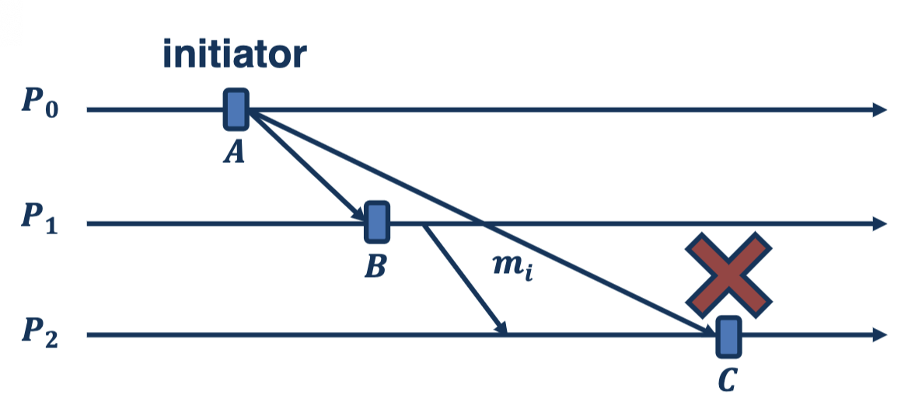

## Communication-Induced Checkpoints

### How do we coordinate a checkpoint?

- **Blocking**
  - An initiator initiates 2PC
    - When a process gets the checkpoint request it blocks and stops all underlying application work
  - Other consensus algorithms can be used as well
- **Non-blocking:** global snapshot algorithm
  - Instead of marker, piggyback info
    - No need for FIFO
  - Nodes can make independent decisions about local snapshot
    - Helps if no communication
  - In-between, checkpoint decisions forced based on piggybacked info
    - Snapshot is taken before message is received

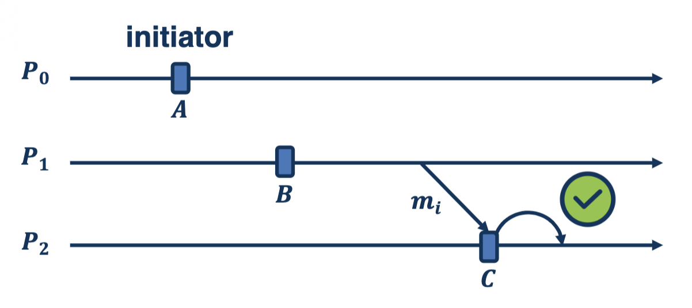

## Logging

### Benefits of Logging

- Logging vs. Checkpointing = Compute vs. I/O
- Logs at each node must allow consistent state to be rebuilt

### Approaches to Logging

- **Pessimistic:** log everything to persistent storage before allowing event to propagate and commit
- **Optimistic:** assume log will be persistent before failure, but make it possible to remove effects if abort needed
- **Causality-tracking:** ensure causally related events are deterministically recorded

## Which Method to Use?

- Depends on a number offactors:
  1.  Workload characteristics?
  2.  Failure characteristics?
  3.  System characteristics?
      - Cost/overhead of communication?
      - Cost/overhead of stable storage?
      - System scale?

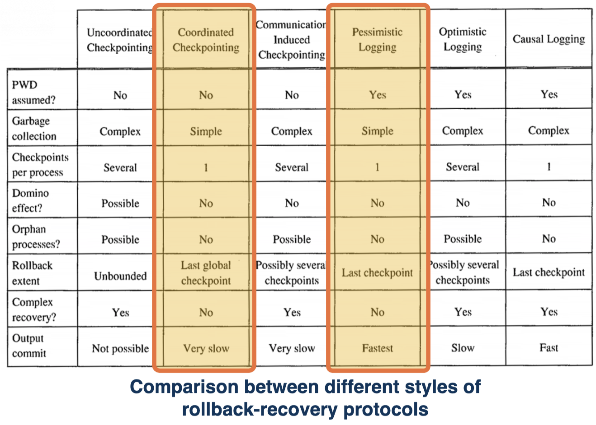
