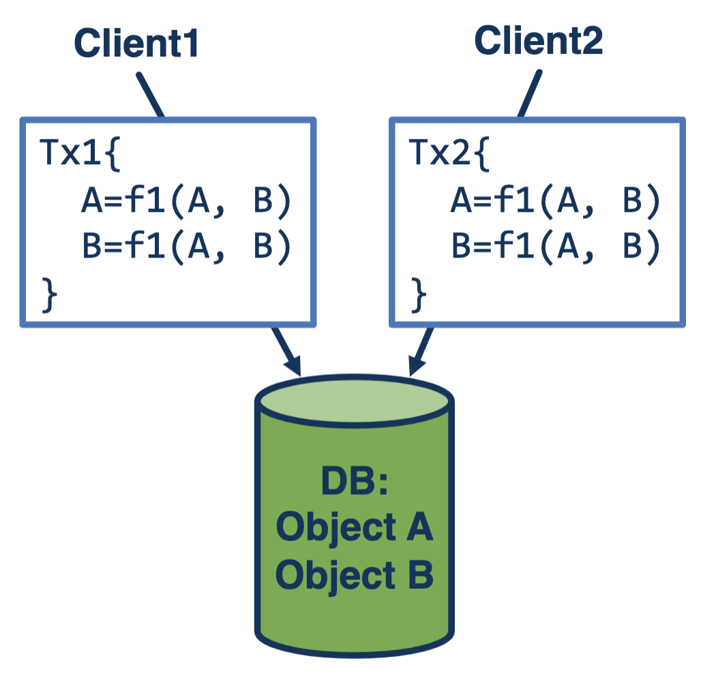
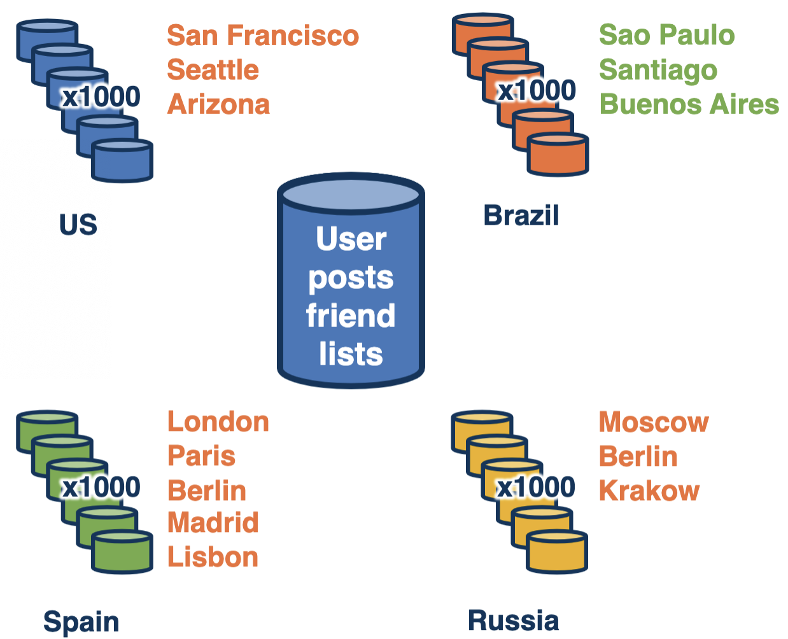
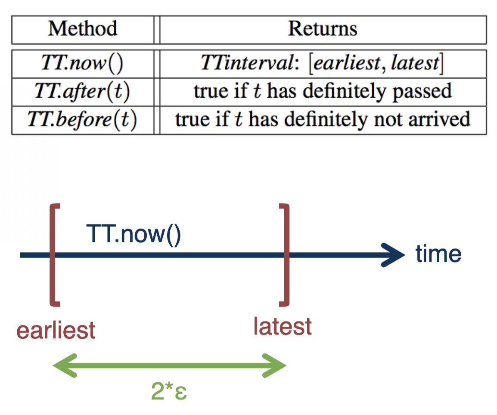
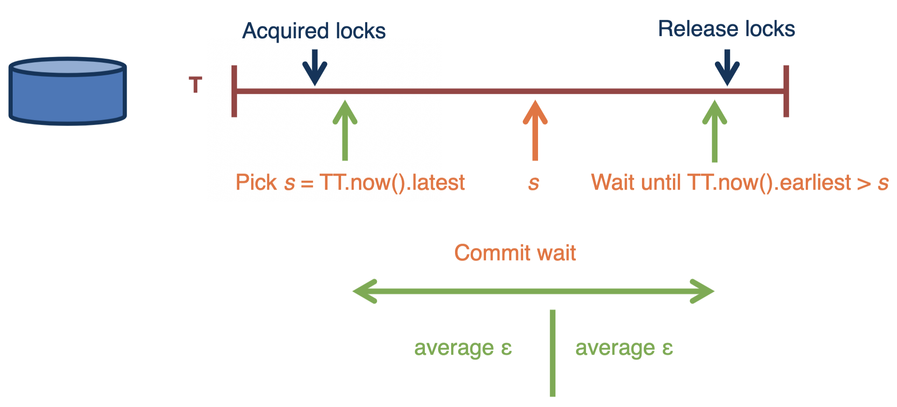

# Distributed Transactions

## What Are Distributed Transactions?

- Groups of operations **applied together**
- Ideally with **ACID properties** (Atomicity, consistency, isolation, and durability)
- Useful for **concurrency and fault tolerance**
- **Possible outcomes:** commit or abort

- Has a coordinator and the transaction occurs at multiple sites
- The coordinator (leader) **ensures correctness** (2PC, consensus, etc.)
  - Across participants of a single distributed transaction
  - Across multiple distributed transactions

## Spanner

### Brief

- **Global data store**
  - Geographically distributed
  - Sharded
  - Replicated
- **Google’s relational DB service**
  - Ads, Play, and other internal services
  - External cloud DB service

### Stack

- **Distributed persistent storage**
  - Distributed file system, GFS [SOSP’03], Colossus
- **Data model**
  - Versioned (timestamped) key-value store (based on BigTable [OSDI’06])
  - Tablet, directory – group of related objects
  - Relational database, Megastore [CIDR’11]
- **Replicated state machine w/ Paxos, per tablet**
  - Sufficient for transactions within a set of replicas
- **2 phase locking for concurrency control**
- **2 phase commit for cross-replica set transactions**

### Consistency Requirements

- **Consistency matters**
- Order of events in the system == order in which events appeared in real world/global wall clock
- If Tx1 completed before Tx2 started, Tx2 must be guaranteed to see Tx1’s writes

### True Time

- TT != absolute real time
- TT == uncertainty interval around real time
- Implemented using periodic probing of master clock servers in datacenters
  - GPS and atomic
  - 2 ε

