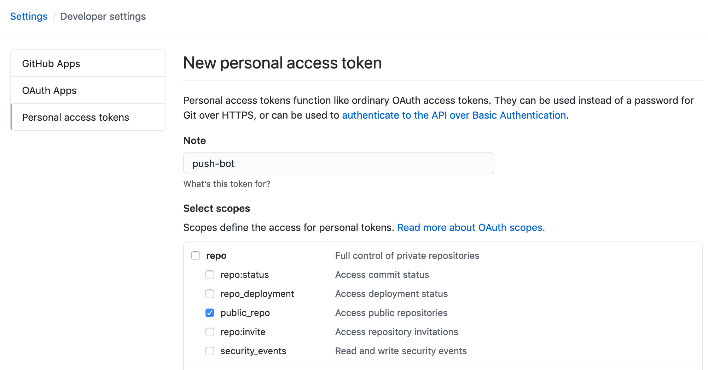

# Automate the Pushing of Commits to a Repository
This TIL guides you through the process of pushing new local commits to a GitHub repository using GitHub Actions.

## Personal Access Token
First, you'll want to configure a personal access token that GitHub Actions can use to access the repository and push to it.  This can be done from the [the settings page](https://github.com/settings/tokens).  Under `repo`, you'll want to select the `public_repo` scope.



## Automation via build.yml
In order to automate the commit and push (if changes are found), you can add the following to your `.github/workflows/build.yml` file:

```yaml
jobs:
  build:
    runs-on: ubuntu-latest
    steps:
    - name: Checkout repository
      uses: actions/checkout@v2
    - name: Commit and push (if changed)
      run: |-
        git diff
        git config --global user.name "automated-bot"
        git config --global user.email "actions@users.noreply.github.com"
        git add .
        git commit -m "This is an automated update." || exit 0
        git push
```

## Optional: cronjob
If you want to configure a cron schedule for the GitHub Action to run on, this can be done in your `.github/workflows/build.yml` file as seen below.  In this example, the schedule is running daily at midnight.

```yaml
on:
  schedule:
    - cron:  '0 0 * * *'
```
