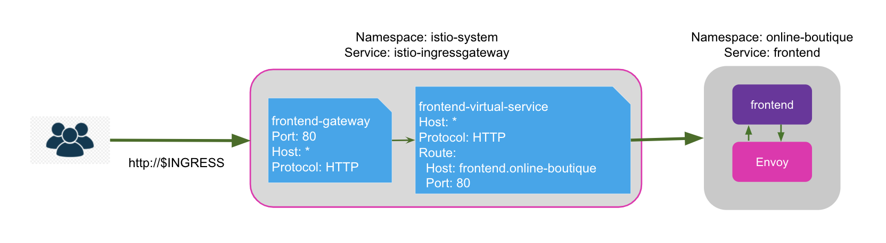

# Exposing Applications on an HTTP Port

## Configure Istio Ingress Gateway

This section covers how to configure an Istio ingress gateway installed in the `istio-system` namespace and using Istio APIs to expose `my-test-app` on HTTP port 80. Using Istio ingress gateway, you can easily expose your application to the internet, allowing users to consume your application.

### Configure an Istio ingress gateway

You need to be able to access the `istio-ingressgateway` service from outside your cluster. Check that the service type of `istio-ingressgateway` is `LoadBalancer` and there is a valid external IP.

```sh
$ kubectl -n istio-system get svc istio-ingressgateway
```

In order to allocate an external IP for minikube, you need to run the [`minikube tunnel` command](https://minikube.sigs.k8s.io/docs/handbook/accessing/#loadbalancer-access) continuously in another terminal. Once the minikube tunnel is successfully running, the external IP should be allocated for the `istio-ingressgateway` service.

```sh
minikube tunnel
```

If you’re using a Kubernetes cluster hosted on a cloud provider like AWS or GKE, they automatically assign external load balancer DNS names or IPs for any services of type load balancer. Depending upon the cloud provider, either of these commands should return a non-empty value.

```
kubectl -n istio-system get svc istio-ingressgateway \
  -o jsonpath='{.status.loadBalancer.ingress[0].hostname}'
ac412b690fd414ca3b78caa5c5520188-711347061.us-west-2.elb.amazonaws.com

kubectl -n istio-system get svc istio-ingressgateway \
  -o jsonpath='{.status.loadBalancer.ingress[0].ip}'
34.8.10.7
```

Export the ingress IP or host in an environment variable for future use.

```sh
export INGRESS=$(kubectl -n istio-system get svc istio-ingressgateway \
  -o jsonpath='{.status.loadBalancer.ingress[0].ip}')
```

### Setup Gateway and VirtualService resources

This section covers how to setup Istio Gateway and VirtualService resources. These are tied to the Istio ingress gateway in order to enable traffic from outside the cluster to access a frontend service that users can access.



Istio’s [Gateway resource](https://istio.io/latest/docs/reference/config/networking/gateway/) configures the Layer 4 settings for the ingress gateways.

```sh
kubectl apply -n my-test-app -f - << EOF
apiVersion: networking.istio.io/v1beta1
kind: Gateway
metadata:
  name: frontend-gateway
  namespace: my-test-app
spec:
  selector:
    # Use Istio default gateway implementation
    istio: ingressgateway
  servers:
  - port:
      number: 80
      name: http
      protocol: HTTP
    hosts:
    - "*"
EOF
```

This resource selects the gateway workload deployed in the `istio-system` namespace via the label selector `istio: ingressgateway`. Note that as of Istio 1.6 release, the gateway resource created in any namespace can select workloads in other namespaces.

The gateway workload will match HTTP traffic for any host, as indicated by the asterisk wildcard (`*`). This wildcard should only be used for demo purposes, as allowing traffic for any host leads to security vulnerabilities.

Istio’s [Virtual Service resource](https://istio.io/latest/docs/reference/config/networking/virtual-service/) configures how traffic is routed within the mesh. Create the following VirtualService resource:

```sh
kubectl apply -n my-test-app -f - << EOF
apiVersion: networking.istio.io/v1alpha3
kind: VirtualService
metadata:
  name: frontend-virtual-service
  namespace: my-test-app
spec:
  hosts:
  - "*"
  gateways:
  - frontend-gateway
  http:
  - route:
    - destination:
        host: frontend
        port:
          number: 80
EOF
```

This resource selects the Gateway resource created above by its name `frontend-gateway`. It is allowed to reference Gateway resources in other namespaces by using the syntax `gateway-namespace/gateway-name`. If no Gateway namespace is provided, then by default only Gateway resources in the same namespace where the VirtualService resource is defined are searched.

It’s important to understand how the destination host services are searched based on the host value. If you use the short form name like `frontend`, then the Istio control plane converts it to the fully qualified domain name (FQDN) like this: `frontend.my-test-app.svc.cluster.local`, by appending the namespace where the VirtualService resource is defined (`my-test-app` in this case) and the Kubernetes domain suffix. For clarity and correctness, it is recommended to use the long form FQDN for the destination host in production environments.

The port number used in the route destination field should match the port number of the Kubernetes service that you wish to expose to the internet. In this scenario, the application’s frontend service is used, which has the service port `80` targeting the container port `8000`.

```shkubectl -n my-test-app get svc frontend -o yaml
apiVersion: v1
kind: Service
metadata:
  name: frontend
  namespace: my-test-app
spec:
  ports:
  - name: http
    port: 80
    protocol: TCP
    targetPort: 8080
  selector:
    app: frontend
  sessionAffinity: None
  type: ClusterIP
```

An HTTP route defined with no matchers is called a default route. There should only be one default route defined in any VirtualService resource. Ideally, the default route should be defined at the end, as the route rules are evaluated in the order listed in the resource. If there are multiple default routes defined, or there are non-default routes defined after a default route in the same VirtualService, all routes after the first default routes are ignored.

Users should now be able to access the application from the browser at `http://$INGRESS`.

## Expose a New Version of the Frontend Microservice

This section details how to deploy a new version of the frontend microservice and uses Istio’s traffic management capabilities to expose the new functionality to selected users. This is important because:

- Using Istio’s routing capabilities, you can gradually migrate traffic from an older to a newer version of your application, thereby verifying the functionality of the newer version and reducing risk by only exposing it to a subset of your users and gathering feedback before rolling it out entirely.
- You can use advanced routing patterns like path-based routing to expose various applications on a single Istio ingress gateway, thereby reducing maintenance and resource costs.

### Deploy a new version of the frontend service

Deploy the new frontend microservice.

```sh
kubectl -n my-test-app apply -f frontend-v2.yaml
```

Verify that new frontend microservice (v2) is deployed and running.

```sh
kubectl -n my-test-app get pods -l app=frontend-v2
```
