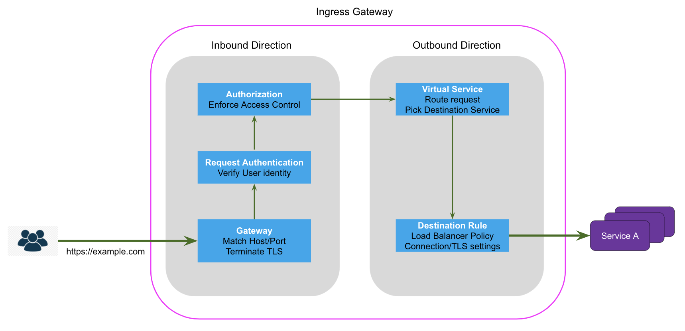

# Istio APIs

With Istio APIs, you can configure various aspects of traffic flowing through the services in your mesh. Those services are defined as Kubernetes [Custom Resource Definitions](https://kubernetes.io/docs/tasks/extend-kubernetes/custom-resources/custom-resource-definitions/) (CRDs), which operators use to manage Istio using Kubernetes native tooling.

Below is an example of a VirtualService resource defined to route 50% of traffic to version “v1” of the frontend service and the remaining 50% to version “v2” as a Kubernetes CRD resource.

```yaml
apiVersion: networking.istio.io/v1alpha3
kind: VirtualService
metadata:
  name: frontend-virtual-service
  namespace: online-boutique
spec:
  hosts:
    - "*"
  gateways:
    - frontend-gateway
  http:
    - route:
        - destination:
            host: frontend
            port:
              number: 80
          weight: 50
        - destination:
            host: frontend-v2
            port:
              number: 80
          weight: 50
```

## Gateways

- [Istio gateways](https://istio.io/latest/docs/reference/config/networking/gateway/) control the exposure of services at the edge of the mesh, making it possible for operators to specify Layer 4 (L4)-Layer 6 (L6) settings for the proxy.
- Gateways can be deployed as ingress and/or egress, making it possible for operators to control incoming and outgoing TCP and HTTP(s) traffic. Gateways describe a set of ports that should be exposed, the type of protocol to use, TLS and [Server Name Indication](https://en.wikipedia.org/wiki/Server_Name_Indication) (SNI) configuration for the proxy.

## Virtual Services

- [Virtual services](https://istio.io/latest/docs/reference/config/networking/virtual-service/) define a set of traffic rules used to route a request to a service based on its hostname and other match attributes derived from the request and the source.
- You can use virtual services to specify traffic behavior and how to route it without directly coupling it with the destination workload providing the service.
- You can attach virtual services to Gateways to control ingress or egress traffic and also to control traffic routing between workloads within the mesh.
- These traffic rules are enforced on the client-side proxy before any request is made to the destination.
- Virtual services support advanced routing capabilities for HTTP 1.1/2.0, gRPC, TCP, and TLS protocols. Additionally, for HTTP traffic, you can use virtual services to perform retries, timeouts, inject faults, and mirror traffic apart from routing it to a destination based on advanced match criterion.

## Destination Rules

- [Destination rules](https://istio.io/latest/docs/reference/config/networking/destination-rule/) define policies that apply to traffic intended for a service once routing has occurred. The rules are applied after virtual service routing rules have been evaluated and the destination service has been picked.
- Destination rules specify configuration for what happens to the traffic; for example, load balancing algorithm, connection level settings from the sidecar proxy, and whether traffic should be encrypted.
- Virtual services in conjunction with destination rules define how to route the traffic and what to do with the traffic to get it to the destination.

## Request Authentication

- [Request authentication](https://istio.io/latest/docs/reference/config/security/request_authentication/) defines how to verify the end-user identity based on the credentials attached to the request. Istio supports JSON Web Token (JWT) validation for authenticating users.
- Istio attaches identity to the request based on presented credentials. The identity can be used to enforce access control via authorization policies.
- Istio rejects any request if the request contains invalid authentication information based on the configured authentication rules. However, if no authentication credential is presented, the request is allowed, but no identity is attached to the request.

## Authorization Policy

- [Authorization policies](https://istio.io/latest/docs/reference/config/security/authorization-policy/) enable you to configure access control for workloads within the mesh and at the gateways.
- These policies can be used to allow or deny requests based on various attributes of the request and/or the requesting workload/user.
- End-user identity can also be used if available and exposed via the request authentication policies. The authorization policies work in conjunction with request authentication policies to only allow verified user identities to access protected resources on a workload.



The above diagram depicts how these different APIs interact with each other and affect the traffic flow at an ingress gateway. All these APIs collectively inform whether a particular request would be accepted or rejected, what policies will be applied, where the request would be routed and how the request would be sent to the destination service. Note that the inbound direction at the ingress gateway indicate the traffic flow from users outside the cluster to the ingress gateway and outbound direction indicate the traffic flow from the ingress gateway to the services in the cluster. This logical separation allows us to see at what stage of traffic processing various Istio resources take effect.
