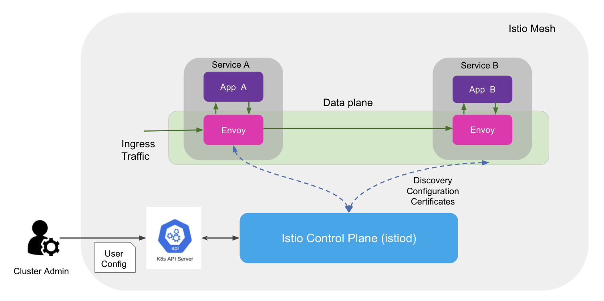
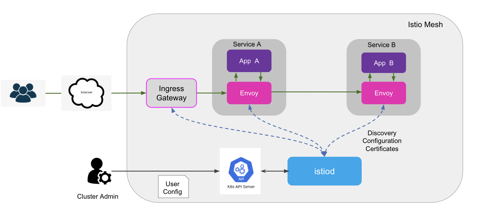

# Istio Architecture

## Overview

[Istio service mesh](https://istio.io/) helps manage the communication between microservices that compose an application by making them operationally secure and reliable. Istio is most commonly run in a Kubernetes cluster and is managed with Kubernetes custom resource objects.

Istio provides three core capabilities:

1. [**Traffic Management**](https://istio.io/latest/docs/concepts/traffic-management/): Istio’s advanced traffic configuration like request routing, circuit breaking, fault injection, and so on, allows you to control the flow of traffic between microservices. These options make it possible for operators to build resilient applications without embedding the logic within the applications.
2. [**Security**](https://istio.io/latest/docs/concepts/security/): Istio provides key security functionalities like authentication, authorization, and encryption of traffic between microservices. This makes it possible for you to enforce policies consistently across multiple protocols and runtimes with no application changes.
3. [**Observability**](https://istio.io/latest/docs/concepts/observability/): Istio emits telemetry in the form of metrics, tracing, or access logs for any traffic flowing through the mesh. With these metrics, operators can understand application behavior and diagnose issues without changing the underlying application.

Istio provides these capabilities by adding a sidecar proxy which is a helper proxy added next to your workloads that intercepts all traffic coming in and out of your workloads. These intelligent proxies enforce various traffic and security policies for traffic flowing through the mesh as configured by the mesh operator. As this proxy is a separate container or process managed outside the development lifecycle of your application workload, it allows platform operators to configure policies without requiring any application code changes.

## Architecture

Istio architecture consists of a control plane responsible for configuring mesh traffic and a data plane composed of sidecar proxies to mediate and control traffic flow. This split in architecture allows allows extensibility and separation of concerns whereby data plane can scale with your application workloads independent of the control plane. The following diagram depicts the various components of Istio architecture and how the traffic interception works within the mesh.

- **Data Plane**: As mentioned above, workloads in Istio are augmented by injecting a dedicated intelligent sidecar proxy. Instead of calling services directly over the network, each workload calls its local sidecar proxy, which in turn encapsulates the complexities of the service-to-service exchange. Additionally, Istio also provides an ingress/egress gateway to manage traffic into and out of your cluster. This interconnected set of proxies in Istio constitute the data plane.
  - Istio uses the [Envoy proxy](https://www.envoyproxy.io/docs/envoy/latest/) as its data plane component. Keep in mind that because Istio is designed to be proxy-agnostic, other proxies may be used in the future in place of Envoy. Envoy is an extensible cloud native proxy that supports network protocols like HTTP 1.1, HTTP 2, gRPC, and TCP, among others, and a dynamic way to reload configuration and extension mechanisms to add new protocol support.
- **Control Plane**: You can think of the control plane as a management server for the data plane proxies. The control plane takes the user-provided configuration, like security or traffic management, and in turn configures the data plane proxies in order to control the proxies’ behaviors across the mesh. The control plane provides an abstraction between the user-facing APIs for configuring Istio and the data plane (Envoy) configuration.

## Components

This section provides an overview of core components used in Istio’s data and control planes.

### Envoy

- Istio uses an extended version of the Envoy proxy in the data plane. Envoy is a high-performance cloud native proxy that is dynamically reconfigurable via APIs; it provides an extension mechanism to add new functionality via filters written in C++ or WebAssembly (WASM). In Istio, by default, Envoy proxies are configured to intercept all inbound and outbound traffic for services in the mesh. Envoy is the only component that interacts with the application data directly.
- Istio deploys the Envoy proxy in sidecar mode for workloads in the mesh. As the traffic is intercepted and proxied through the Envoy proxy, it can steer the traffic, apply policy, and generate telemetry, all without re-architecting or rewriting application code.

### Istio Daemon (Istiod)

- The Istio control plane is responsible for configuring the data plane (Envoy), providing an abstraction layer for the mesh operators. The key functionalities of the control plane are to:
  - Validate and process any user-provided mesh configuration.
  - Automatically discover services and workloads from the underlying platform (such as Kubernetes).
  - Combine high-level routing and policy configuration with service information and configure the Envoy proxies via an [xDS](https://www.envoyproxy.io/docs/envoy/latest/api-docs/xds_protocol) server.
  - Act as certificate authority by signing certificates used for encrypting traffic between workloads.

### Ingress Gateway

- Ingress refers to traffic that originates outside the local network and is intended for workloads within the local network. These gateways act as strategic points of control for all traffic coming into the cluster from outside and are used for enforcing policies and surfacing telemetry as they proxy the traffic to the local workload.
- Istio uses Envoy as the ingress gateway, where it is deployed as a standalone proxy, as compared to the sidecar deployment used within the mesh.

The following diagram shows where the ingress gateway fits into the architecture and how the traffic from the users outside of your cluster is routed via the ingress gateway to workloads within the mesh.

