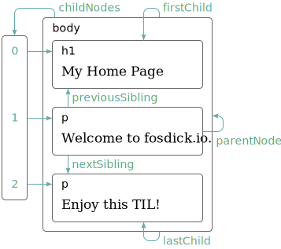

# The Document Object Model

## Document Structure

The DOM is organized like a tree, in which elements are arranged hierarchically according to the structure of the document.

The global binding `document` gives us access to objects in the DOM. It's `documentElement` property refers to the object representing the `<html>` tag. Since every HTML document has a head and a body, it also has `head` and `body` properties, pointing at those elements.

## Trees

Each DOM node object has a `nodeType` property, which contains a code (number) that identifies the type of node. Elements have code 1, which is also defined as the constant property `Node.ELEMENT_NODE`. Text nodes, representing a section of text in the document, get code 3 (`Node.TEXT_NODE`). Comments have code 8 (`Node.COMMENT_NODE`).

## Moving Through The Tree

DOM nodes contain a wealth of links to other nearby nodes. Every node has a `parentNode` property that points to the node it is part of, if any. Likewise, every element node (node type 1) has a `childNodes` property that points to an array-like object holding its children.



The `firstChild` and `lastChild` properties point to the first and last child elements or have the value null for nodes without children. Similarly, `previousSibling` and `nextSibling` point to adjacent nodes, which are nodes with the same parent that appear immediately before or after the node itself. For a first child, `previousSibling` will be null, and for a last child, `nextSibling` will be null.

## Finding Elements

If you want to find a specific node in the document, reaching it by starting at `document.body` and following a fixed path of properties is a bad idea. Doing so bakes assumptions into your program about the precise structure of the document — a structure you might want to change later.

All element nodes have a `getElementsByTagName` method, which collects all elements with the given tag name that are descendants (direct or indirect children) of that node and returns them as an array-like object.

```javascript
let link = document.body.getElementsByTagName("a")[0];
console.log(link.href);
```

To find a specific single node, you can give it an id attribute and use `document.getElementById` instead.

```html
<p>My image:</p>
<p></p>

<script>
  let myimage = document.getElementById("imageid");
  console.log(myimage.src);
</script>
```

A third, similar method is `getElementsByClassName`, which, like `getElementsByTagName`, searches through the contents of an element node and retrieves all elements that have the given string in their class attribute.

## Changing The Document

Nodes have a `remove` method to remove them from their current parent node. To add a child node to an element node, we can use `appendChild`, which puts it at the end of the list of children, or `insertBefore`, which inserts the node given as the first argument before the node given as the second argument.

```html
<p>One</p>
<p>Two</p>
<p>Three</p>

<script>
  // Insert paragraph Three in front of paragraph One.  This will first remove it
  // from the end of the document and then insert it at the front.
  let paragraphs = document.body.getElementsByTagName("p");
  document.body.insertBefore(paragraphs[2], paragraphs[0]);
</script>
```

The `replaceChild` method is used to replace a child node with another one. It takes as arguments two nodes: a new node and the node to be replaced. The replaced node must be a child of the element the method is called on. Note that both `replaceChild` and `insertBefore` expect the new node as their first argument.

## Creating Nodes

Text nodes are created with the `document.createTextNode` method.

```html
<p>
  The  in the
  .
</p>
<p><button onclick="replaceImages()">Replace</button></p>

<script>
  /*
  The loop that goes over the images starts at the end of the list. This is
  necessary because the node list returned by a method like
  getElementsByTagName (or a property like childNodes) is live. That is, it is
  updated as the document changes. If we started from the front, removing the
  first image would cause the list to lose its first element so that the second
  time the loop repeats, where i is 1, it would stop because the length of the
  collection is now also 1.

  If you want a solid collection of nodes, as opposed to a live one, you can 
  convert the collection to a real array by calling Array.from.
  */
  function replaceImages() {
    let images = document.body.getElementsByTagName("img");
    for (let i = images.length - 1; i >= 0; i--) {
      let image = images[i];
      if (image.alt) {
        let text = document.createTextNode(image.alt);
        image.parentNode.replaceChild(text, image);
      }
    }
  }
</script>
```

To create element nodes, you can use the `document.createElement` method. This method takes a tag name and returns a new empty node of the given type.

## Attributes

Some element attributes, such as `href` for links, can be accessed through a property of the same name on the element's DOM object. This is the case for most commonly used standard attributes.

However, HTML allows you to set any attribute you want on nodes. This can be useful because it allows you to store extra information in a document. If you make up your own attribute names though, such attributes will not be present as properties on the element's node. Instead, you have to use the `getAttribute` and `setAttribute` methods to work with them.

```html
<p data-classified="secret">The launch code is 00000000.</p>
<p data-classified="unclassified">This is not secret.</p>

<script>
  let paragraphs = document.body.getElementsByTagName("p");
  for (let paragraph of Array.from(paragraphs)) {
    if (paragraph.getAttribute("data-classified") == "secret") {
      paragraph.remove();
    }
  }
</script>
```

It is recommended to prefix the names of such made-up attributes with `data-` to ensure they do not conflict with any other attributes.

There is a commonly used attribute, `class`, which is a keyword in the JavaScript language. For historical reasons (some old JavaScript implementations could not handle property names that matched keywords), the property used to access this attribute is called `className`. You can also access it under its real name, `class`, by using the `getAttribute` and `setAttribute` methods.

## Layout

Different types of elements are laid out differently. Some, such as paragraphs (`<p>`) or headings (`<h1>`), take up the whole width of the document and are rendered on separate lines. These are called _block_ elements. Others, such as links (`<a>`) or the `<strong>` element, are rendered on the same line with their surrounding text. Such elements are called _inline_ elements.

A pixel is the basic unit of measurement in the browser. It traditionally corresponds to the smallest dot that the screen can draw. However, on modern displays (which can draw very small dots) that is not always the case, so a browser pixel may span multiple display dots.

The `offsetWidth` and `offsetHeight` properties give you the space the element takes up in pixels. Similarly, `clientWidth` and `clientHeight` give you the size of the space inside the element, ignoring border width.

The most effective way to find the precise position of an element on the screen is the `getBoundingClientRect` method. It returns an object with top, bottom, left, and right properties, indicating the pixel positions of the sides of the element relative to the top left of the screen. If you want them relative to the whole document, you must add the current scroll position, which you can find in the `pageXOffset` and `pageYOffset` bindings.

In the interest of speed, browser engines do not immediately re-layout a document every time you change it but wait as long as they can. A program that repeatedly alternates between reading DOM layout information and changing the DOM forces a lot of layout computations to happen and will consequently run very slowly.

```html
<p><span id="one"></span></p>
<p><span id="two"></span></p>

<script>
  // Two different programs that build up a line of X characters 2,000 pixels
  // wide and measures the time each one takes.
  function time(name, action) {
    let start = Date.now(); // Current time in milliseconds
    action();
    console.log(name, "took", Date.now() - start, "ms");
  }

  time("naive", () => {
    let target = document.getElementById("one");
    while (target.offsetWidth < 2000) {
      target.appendChild(document.createTextNode("X"));
    }
  });
  // → naive took 32 ms

  time("clever", function () {
    let target = document.getElementById("two");
    target.appendChild(document.createTextNode("XXXXX"));
    let total = Math.ceil(2000 / (target.offsetWidth / 5));
    target.firstChild.nodeValue = "X".repeat(total);
  });
  // → clever took 1 ms
</script>
```

## Styling

Some style property names contain hyphens, such as `font-family`. Because such property names are awkward to work with in JavaScript (you’d have to say `style["font-family"]`), the property names in the style object for such properties have their hyphens removed and the letters after them capitalized (`style.fontFamily`).

## Cascading Styles

The cascading in the name refers to the fact that multiple such rules are combined to produce the final style for an element.

When multiple rules define a value for the same property, the most recently read rule gets a higher precedence and wins. The precedence rule favoring the most recently defined rule applies only when the rules have the same _specificity_. A rule’s specificity is a measure of how precisely it describes matching elements, determined by the number and kind (tag, class, or ID) of element aspects it requires. For example, a rule that targets `p.a` is more specific than rules that target `p` or just `.a` and would thus take precedence over them.

## Query Selectors

The `querySelectorAll` method, which is defined both on the document object and on element nodes, takes a selector string and returns a `NodeList` containing all the elements that it matches. Unlike methods such as `getElementsByTagName`, the object returned by `querySelectorAll` is _not_ live. It won’t change when you change the document. It is still not a real array, though, so you still need to call `Array.from` if you want to treat it like one.

The `querySelector` method (without the `All` part) works in a similar way. This one is useful if you want a specific, single element. It will return only the first matching element or null when no element matches.

## Positioning and Animating

The `position` style property influences layout in a powerful way. By default it has a value of `static`, meaning the element sits in its normal place in the document. When it is set to `relative`, the element still takes up space in the document, but now the `top` and `left` style properties can be used to move it relative to that normal place. When position is set to `absolute`, the element is removed from the normal document flow — that is, it no longer takes up space and may overlap with other elements. Also, its `top` and `left` properties can be used to absolutely position it relative to the top-left corner of the nearest enclosing element whose `position` property isn’t `static`, or relative to the document if no such enclosing element exists.

Browsers do not update their display while a JavaScript program is running, nor do they allow any interaction with the page. You can use `requestAnimationFrame` to inform the browser that you are done for now, so it can go ahead and do the things that browsers do (such as updating the screen and responding to user actions). This happens by passing a function to `requestAnimationFrame` that it then schedules to run whenever the browser is ready to repaint the screen.
