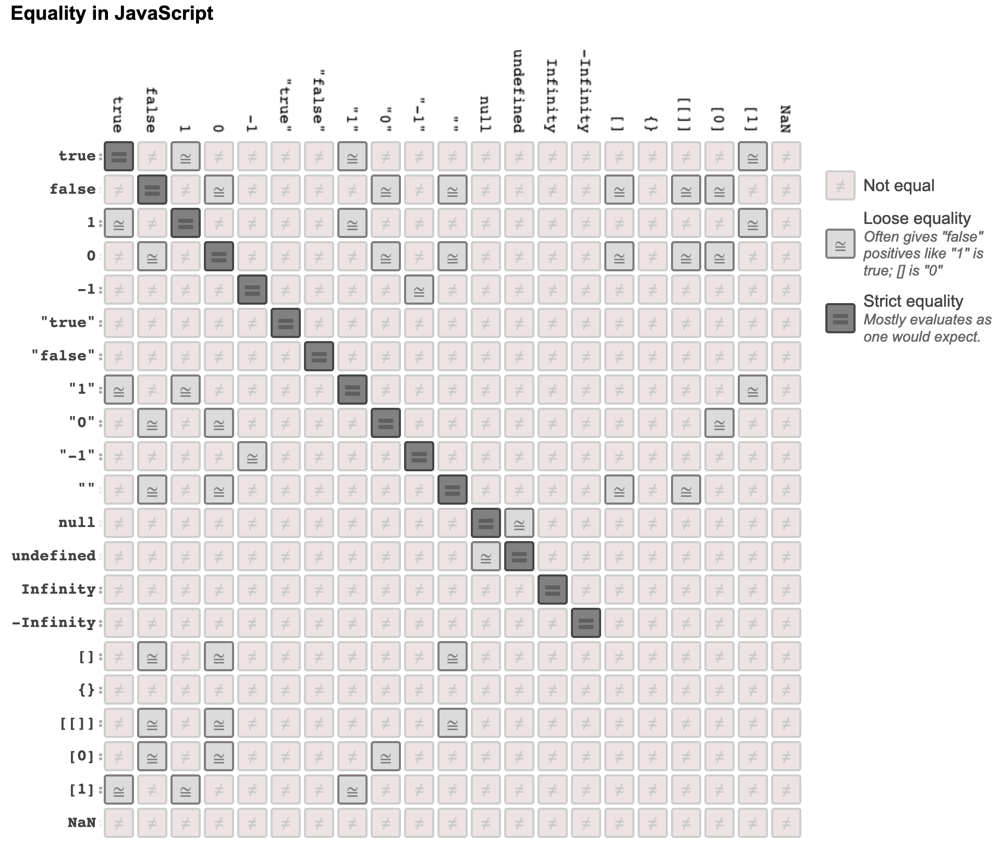

# JavaScript Notes

## JavaScript is Interpreted
- Each browser has its own JavaScript engine, which either interprets the code or uses some sort of lazy compilation
  - V8: Chrome and Node.js
  - SpiderMonkey: Firefox
  - JavaScriptCore: Safari
  - Chakra: Microsoft Edge/IE
- They each implement the ECMAScript standard, but may differ for anything not defined by the standard

## Syntax
```javascript
const name = 'GitHub';
const arr = ['Some text', 42, true, function() {
    console.log('hi')
}];
for (let i = 0; i < arr.length; i++) {
    console.log(arr[i]);
}
```

## Types
- Dynamic typing
- Primitive types (no methods, immutable)
  - `undefined`
  - `null`
  - `boolean`
  - `number`
  - `string`
  - `symbol`
- Objects

### Primitives vs. Objects
- Primitives are immutable and stored by value
- Objects are mutable and stored by reference

## Typecasting / Coercion

### Explicit vs. Implicit Coercion
```javascript
const x = 42;
const explicit = String(x);  // explicit === "42"
const implicit = x + "";     // implicit === "42"
```

### `==` vs. `===`
- `==` coerces the types
- `===` requires equivalent types



### Coercion
- Which values are falsy?
  - `undefined`
  - `null`
  - `false`
  - `+0`, `-0`, `NaN`
- Which values are truthy?
  - `{}`
  - `[]`
  - Everything else

## Prototypal Inheritance
- Non-primitive types have a few properties/methods associated with them
  - `Array.prototype.push()`
  - `String.prototype.toUpperCase()`
- Each object stores a reference to it's prototype
    - Properties/methods defined most tightly to the instance have priority
    - Most primitive types have object wrappers
- JavaScript will automatically “box” (wrap) primitive values so you have access to methods

```javascript
42.toString()        // Errors
const x = 42;
x.toString()         // "42"
x.__proto__          // [Number: 0]
x instanceof Number  // false
```

## Scope

### Variable lifetime
- Lexical scoping (`var`): from when they’re declared until when their function ends
- Block scoping (`const`, `let`): until the next `}` is reached

### Hoisting
- Function definitions are hoisted, but not lexically-scoped initializations

```javascript
function thisIsHoisted() {
    console.log('This is hoisted.')
}

const thisIsNotHoisted = function() {
    console.log('This is NOT hoisted.')
}
```

## The Global Object
- All variables and functions are actually parameters and methods on the global object
  - Browser global object is the `window` object
  - Node.js global object is the `global` object
