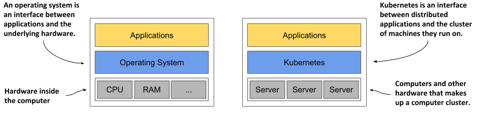
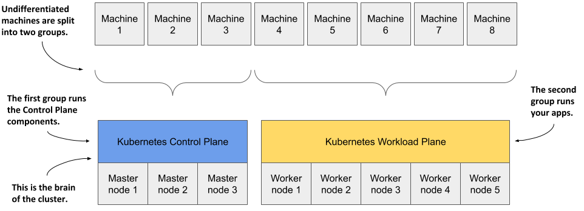

# How Kubernetes Transforms a Computer Cluster

## Kubernetes is like an operating system for computer clusters

One can imagine Kubernetes as an operating system for the cluster. Just as an operating system supports the basic functions of a computer, such as scheduling processes onto its CPUs and acting as an interface between the application and the computer’s hardware, Kubernetes schedules the components of a distributed application onto individual computers in the underlying computer cluster and acts as an interface between the application and the cluster.

It frees application developers from the need to implement infrastructure-related mechanisms in their applications; instead, they rely on Kubernetes to provide them. This includes things like:

- **Service Discovery** - a mechanism that allows applications to find other applications and use the services they provide
- **Horizontal Scaling** - replicating your application to adjust to fluctuations in load
- **Load Balancing** - distributing load across all the application replicas
- **Self-Healing** - keeping the system healthy by automatically restarting failed applications and moving them to healthy nodes after their nodes fail
- **Leader Election** - a mechanism that decides which instance of the application should be active while the others remain idle but ready to take over if the active instance fails

By relying on Kubernetes to provide these features, application developers can focus on implementing the core business logic instead of wasting time integrating applications with the infrastructure.

## How Kubernetes fits into a computer cluster

You start with a fleet of machines that you divide into two groups - the master and the worker nodes. The master nodes will run the Kubernetes Control Plane, which represents the brain of your system and controls the cluster, while the rest will run your applications - your workloads - and will therefore represent the Workload Plane.

Non-production clusters can use a single master node, but highly available clusters use at least three physical master nodes to host the Control Plane. The number of worker nodes depends on the number of applications you’ll deploy.

## How all cluster nodes become one large deployment area

After Kubernetes is installed on the computers, you no longer need to think about individual computers when deploying applications. Regardless of the number of worker nodes in your cluster, they all become a single space where you deploy your applications. You do this using the Kubernetes API, which is provided by the Kubernetes Control Plane.
