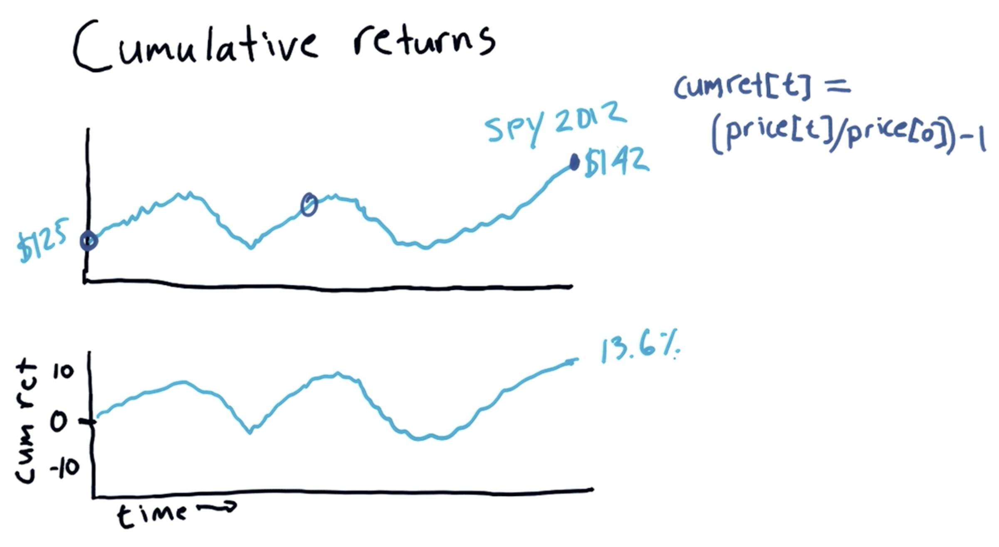

# Python for Finance

## Statistical Analysis of Time Series Data

### Rolling Statistics


- [`rolling` Documentation](https://pandas.pydata.org/pandas-docs/stable/reference/api/pandas.DataFrame.rolling.html)

```python
# Read data
dates = pd.date_range('2010-01-01', '2012-12-31')
symbols = ['SPY', 'XOM', 'GOOG', 'GLD']
df = get_data(symbols, dates)

# Plot SPY
ax = df['SPY'].plot(title='SPY Rolling Mean', label='SPY')

# Compute rolling mean using a 20-day window
rm_spy = df['SPY'].rolling(window=20).mean()

# Add rolling mean to same plot
rm_spy.plot(label='Rolling mean', ax=ax)

# Add axis labels and legend
ax.set_xlabel('Date')
ax.set_ylabel('Price')
ax.legend(loc='upper left')
plt.show()
```

### Bollinger Bands


```python
# Read data
dates = pd.date_range('2012-01-01', '2012-12-31')
symbols = ['SPY']
df = get_data(symbols, dates)

# Compute Bollinger Bands
# 1. Compute rolling mean
rm_spy = df['SPY'].rolling(window=20).mean()

# 2. Compute rolling standard deviation
rstd_spy = df['SPY'].rolling(window=20).std()

# 3. Compute upper and lower bands
upper_band, lower_band = get_bollinger_bands(rm_spy, rstd_spy)

# Plot raw SPY values, rolling mean and Bollinger Bands
ax = df['SPY'].plot(title='Bollinger Bands', label='SPY')
rm_spy.plot(label='Rolling mean', ax=ax)
upper_band.plot(label='upper band', ax=ax)
lower_band.plot(label='lower band', ax=ax)

# Add axis labels and legend
ax.set_xlabel('Date')
ax.set_ylabel('Price')
ax.legend(loc='upper left')
plt.show()
```

### Daily Returns


```python
# Using Pandas
daily_returns = (df / df.shift(1)) - 1
daily_returns.ix[0, :] = 0
```

### Cumulative Returns

