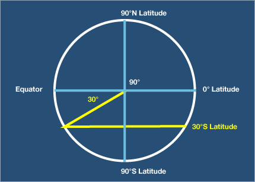
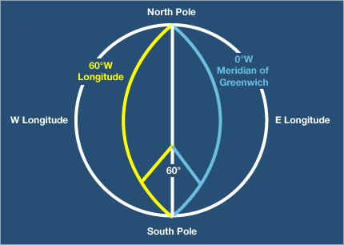
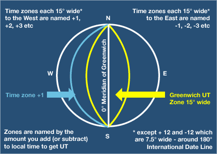
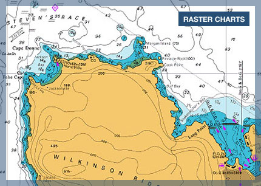
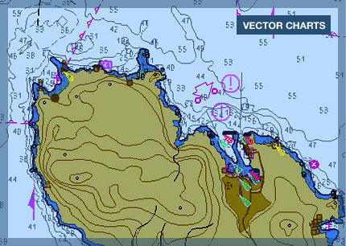
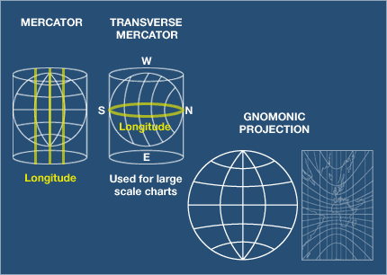
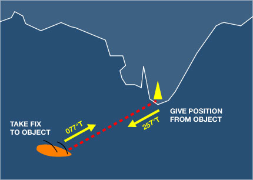

# Yachtmaster Notes

## Latitude and Longitude

### Latitude
- The equator is taken as latitude 0°
  - Therefore the poles of the Earth will be at latitude 90°
  - They are qualified as either North or South and written as 90°N or 90°S.
- Each degree of latitude has 60 minutes and each minute has 60 seconds
    - Nowadays, seconds are rarely used and the custom is to divide each minute into tenths and express it as decimal minutes.
    - One tenth of a minute is one cable, and one minute is one nautical mile.
- A latitude would be expressed as 30° 43'.25 S ie 30 degrees, 43 decimal 25 minutes South.

### Latitude
- Lines joining places of equal longitude are called meridians and they are great circles which start from one pole, cut the equator at right angles and carry on to the other pole.
  - Where the meridians "meet" - at 180° east or west - is the International Date Line and is the agreed point at which the date changes if you are circumnavigating the globe.
  - By convention, the date line is known as 180° east. So, west only goes to 179°. 

### Marine Time Zones

### Charts
- There are two styles of electronic charts - raster and vector.
  - Raster charts are scanned copies of the original paper chart.
  - Vector charts are built up from digital information - much like CAD drawings - and can contain a lot more digitised information which can be interrogated by the user. Also, the detail is stored in layers, so you can show only what you need at any one time.

- Charts come in different scales.
  - 1:30000 is better than 1:100000 for looking at more detail.
  - Also clearly mentioned is the datum to which the chart is drawn (WGS84 for example).
    - This is important when using GPS data and plotting positions from the GPS on to the chart. The datums must be the same to plot accurately and WGS is the most common today.
- Notices to Mariners are issued weekly and give the latest chart corrections.
  - Each notice is numbered so it is possible to ensure that any chart or publication has got all the latest changes incorporated.
  - All the changes over the last 7 years are available at the [UK Hydrographic Office](http://www.ukho.gov.uk/ProductsandServices/MartimeSafety/Pages/NMPublic.aspx).

### Chart Projections
- The benefit of using Mercator is that lines of constant bearing (called Rhumb Lines) will appear as straight lines.
  - Useful for steering compass courses - but only for about 500 miles - and Mercator projection is not useable above 60°N or S.
  -  If you imagine a light bulb inside the earth projecting the images on to flat paper wrapped around the earth – that's Mercator projection.
- Transverse Mercator has the distortion of land east or west from the centre of the chart.
  - This projection is only used for large-scale charts and harbour plans.
- Gnomonic Projection makes great circles appear as straight lines and rhumb lines are curves.
  - Courses can be laid off on these charts, but distance has to be read off a separately provided scale.
  - Used mainly for polar charts and planning ocean crossings.

### Chart Contents
- Depth contours are shown at Chart Datum (CD).
  - This is normally set near the Lowest Astronomical Tide (LAT) so that when you look at depth figures, they are about the minimum you are likely to encounter.
- Heights of objects are measured from either the Highest Astronomical Tide (HAT for clearance under bridges, electric cables) or the Mean High Water for Spring Tides (MHWS for heights of lighthouses, etc).
    - Clearance is likely to be the minimum you will encounter.

### Distance
- One nautical mile is defined internationally as 1,852 meters.
- A cable is one-tenth of a nautical mile.
- Measurements
  - Speed = distance (miles) divided by time (hours) = miles per hour
  - Time = distance divided by speed
  - Distance = speed multiplied by time

### Bearings

- In the example above, the vessel would give its position as "3 miles from the lighthouse bearing 257° T."
- In plotting it's own position on a chart, the bearing would be taken from the vessel.  In this case, the lighthouse bears 077° T from the vessel.
