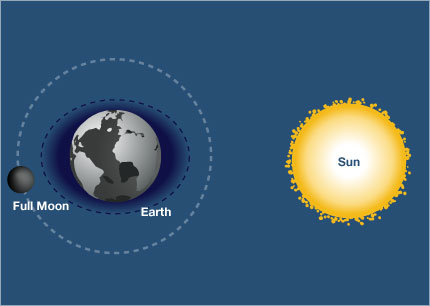
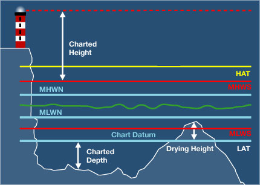
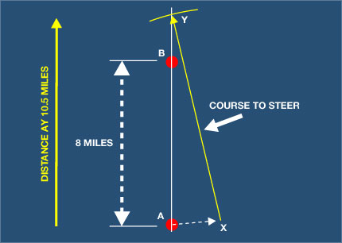

# Yachtmaster Notes

## Latitude and Longitude

### Latitude

- The equator is taken as latitude 0°
  - Therefore the poles of the Earth will be at latitude 90°
  - They are qualified as either North or South and written as 90°N or 90°S.
- Each degree of latitude has 60 minutes and each minute has 60 seconds
    - Nowadays, seconds are rarely used and the custom is to divide each minute into tenths and express it as decimal minutes.
    - One tenth of a minute is one cable, and one minute is one nautical mile.
- A latitude would be expressed as 30° 43'.25 S ie 30 degrees, 43 decimal 25 minutes South.

### Latitude

- Lines joining places of equal longitude are called meridians and they are great circles which start from one pole, cut the equator at right angles and carry on to the other pole.
  - Where the meridians "meet" - at 180° east or west - is the International Date Line and is the agreed point at which the date changes if you are circumnavigating the globe.
  - By convention, the date line is known as 180° east. So, west only goes to 179°.

### Marine Time Zones

### Charts
- There are two styles of electronic charts - raster and vector.
  - Raster charts are scanned copies of the original paper chart.
  - Vector charts are built up from digital information - much like CAD drawings - and can contain a lot more digitised information which can be interrogated by the user. Also, the detail is stored in layers, so you can show only what you need at any one time.

- Charts come in different scales.
  - 1:30000 is better than 1:100000 for looking at more detail.
  - Also clearly mentioned is the datum to which the chart is drawn (WGS84 for example).
    - This is important when using GPS data and plotting positions from the GPS on to the chart. The datums must be the same to plot accurately and WGS is the most common today.
- Notices to Mariners are issued weekly and give the latest chart corrections.
  - Each notice is numbered so it is possible to ensure that any chart or publication has got all the latest changes incorporated.
  - All the changes over the last 7 years are available at the [UK Hydrographic Office](http://www.ukho.gov.uk/ProductsandServices/MartimeSafety/Pages/NMPublic.aspx).

### Chart Projections

- The benefit of using Mercator is that lines of constant bearing (called Rhumb Lines) will appear as straight lines.
  - Useful for steering compass courses - but only for about 500 miles - and Mercator projection is not useable above 60°N or S.
  -  If you imagine a light bulb inside the earth projecting the images on to flat paper wrapped around the earth – that's Mercator projection.
- Transverse Mercator has the distortion of land east or west from the centre of the chart.
  - This projection is only used for large-scale charts and harbour plans.
- Gnomonic Projection makes great circles appear as straight lines and rhumb lines are curves.
  - Courses can be laid off on these charts, but distance has to be read off a separately provided scale.
  - Used mainly for polar charts and planning ocean crossings.

### Chart Contents
- Depth contours are shown at Chart Datum (CD).
  - This is normally set near the Lowest Astronomical Tide (LAT) so that when you look at depth figures, they are about the minimum you are likely to encounter.
- Heights of objects are measured from either the Highest Astronomical Tide (HAT for clearance under bridges, electric cables) or the Mean High Water for Spring Tides (MHWS for heights of lighthouses, etc).
    - Clearance is likely to be the minimum you will encounter.

### Distance
- One nautical mile is defined internationally as 1,852 meters.
- A cable is one-tenth of a nautical mile.
- Measurements
  - Speed = distance (miles) divided by time (hours) = miles per hour
  - Time = distance divided by speed
  - Distance = speed multiplied by time

### Bearings

- In the example above, the vessel would give its position as "3 miles from the lighthouse bearing 257° T."
- In plotting it's own position on a chart, the bearing would be taken from the vessel.  In this case, the lighthouse bears 077° T from the vessel.

---

## Magnetic Compass

### The Magnetic Compass
- A magnetised steel needle is attached to a card with markings on it and this is floated in a liquid (to minimise friction).
- The magnetic pole to which the compass points is not at the same place as the North Pole.
  - This is because the earth's magnetic field is created by molten metal in the earth's core.  For reasons not yet understood, it varies not only on an annual basis (which has moved 1,000 km in the last century), but it also traces an elliptical path of about 80 km per day.
  - This daily movement is ignored for practical navigation purposes, but we have to correct for the distance it is away from the North Pole.  This amount is called **variation**.

### Variation

- CADET (Compass ADd East for True; C &rarr; +E &rarr; T)
- ERROR EAST - COMPASS LEAST
  - This tells us that if the error is east, the compass reading will be less than the true figure.
- ERROR WEST - COMPASS BEST
  - This tells us that if the error is west, the compass reading will be greater than the true figure.

### Compass Rose

- The amount of variation is marked on each chart in the compass rose.
- The figures shows 7° 25' W 1997 (6'E).
  - This means that the variation in 1997 was 7 degrees 25 minutes west and alters annually east by 6 minutes.
  - To get the variation for 2007, we have to modify that figure by the total change - that is 10 years at 6 minutes per year - a total of 60 minutes which is 1 degree.
  - As this change is to the east (decreasing), the west variation will therefore have to be reduced giving a figure of 6 degrees 25 minutes west for 2007.

### Magnetic Bearing

### Deviation
- Compasses rely for their action by being able to respond and indicate the presence and direction of the earth's relatively weak magnetic field.
  - Unfortunately, they will also detect any other stray magnetic fields in the near vicinity.
  - Things like heavy metal objects on a vessel (the engines) can cause the vessel's compass to be deflected and give erroneous readings.  This is called **deviation**.
- Any new compass installation on a vessel requires the attention of an expert compass adjuster, who will arrange the positioning of correction magnets around the compass to minimise the errors caused by such stray fields.
  - The adjuster will then produce a deviation card for the vessel to correct the compass reading on different headings that could not be removed in the correction process.
  - Setting up and checking a compass is called "swinging the compass" and should be checked annually.

- TVMDC (True &rarr; Variation &rarr; Magnetic &rarr; Deviation &rarr; Compass)
  - True Virtues Make Dull Companions
  

### Compass Errors (Key Points)
- **Variation** - caused by the compass pointing at the magnetic pole, which is not the same as the true north pole
- **Deviation** - caused by onboard magnetic influences on the vessel's compass
- **Heeling Error** - caused by changes in the onboard magnetic influences on the vessel's compass when the vessel heels over
  - his would be corrected by the compass installer.

### Relative Bearings

---

## Position

### The Three Point Fix

### Transit (Line of Position)
- A transit is defined as any two points on the same bearing from the observer's viewpoint.

### Dead Reckoning

- Dead reckoning (DR) is the oldest form of plotting a position.
  - It involves using the recorded distance travelled through the water and knowing the direction steered from a known position, which gives a position on the chart.
  - This is fine if there is no tide carrying the vessel in another direction at the same time.

### Estimated Position

- Taking tidal drift into consideration on top of dead reckoning.

### Symbols

### Speed Over Ground

### Leeway

- Leeway represents the effect of the wind on the boat's course.

### Position (Key Points)
- Dead reckoning (DR) of position involves only direction steered and distance run.  It can be accurate if there is no tidal drift.
- Accurate position needs allowance for tide set and drift.  That will then give an estimated position (EP).
- Leeway is the amount a vessel is blown off course by the wind.  We allow for this before plotting the vessel's wake course.
  - Leeway amount depends on the type of vessel, trim, wind strength, etc.

### Running Fix

- Often, there is only one charted object in sight and a running fix is a good way of getting a position from it.
- Example
  1.  Take a bearing on the charted object and plot it on the chart (023° T).
  2.  Note the log reading and time - 0900 and 45.7M - then proceed on a steady course - 080°T for say half an hour.
  3.  Take a second bearing on the charted object (315°T) and note the log and time again - 0930 and 49.7M.
  4.  Plot this course and distance travelled from any point on the first bearing line, that is 080° T for 4 miles (yellow line).
  5.  Then add the tidal vector at the end of the distance run line. Let's say for that half hour the set and drift was 100°T and 0.5M.
  6.  Lay off the tide set and drift from the end of the distance vector.
  7.  Then draw another line (parallel to the first bearing line) passing through the end of the tide vector just plotted.  Where it cuts the second bearing line is your position fix.

---

## Tides

### Tides
- Tides are caused by the gravitational effects between the earth, the moon, and the sun.
  - The moon, being relatively closer, has a proportionally greater effect than the sun.

### Spring Tides

- When the sun and moon are aligned, the combined gravitational pull gives the highest tide.
- Spring tides occur every 2 weeks.

### Neap Tides

- When aligned in this manner, we get the smallest bulges of water with less difference between the high and low tides.
- This gives us the highest tidal ranges occurring roughly every fortnight and the lowest ranges occurring in between.
- Tied with the moon's phases, the tidal cycle is over about 6 hours and 20 minutes, so this advances the times of the tides by about one hour per day.

### Tidal Heights

### Springs or Neaps

### Tidal Curves

### Rule of Twelfths

- The rule states that in the first hour from either high or low water, the height will move by 1 twelfth of the day's range.  In the second hour, it will be 2 twelfths.  In the third hour, it will be 3 twelfths.  And so on..

### Secondary Ports

---

## Tidal Streams

### Tides
- The rise and fall of water level gives rise to water flowing (and reversing) in fairly predictable streams.
- The job of the navigator is to use the tidal steams to best advantage for passage planning.
- Tidal streams are strongest with spring tides.

### Tidal Atlas

- The arrows are varying size and thickness.  The thicker and larger the arrow, the stronger the tide.

### Computation of Rates Tables

### Course to Steer

