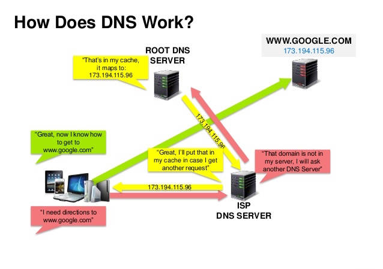

# System Design Notes

## Performance vs. Scalability
- A service is scalable if it results in increased performance in a manner proportional to resources added.
- If you have a performance problem, your system is slow for a single user.  If you have a scalability problem, your system is fast for a single user, but slow under heavy load.

## Latency vs. Throughput
- Latency is the time to perform some action or to produce some result.
- Throughput is the number of such actions or results per unit of time.
- Generally, you should aim for maximal throughput with acceptable latency.

## Availability vs. Consistency
- In a distributed computer system, you can only support two of the following guarantees:
  - **Consistency** - every read receives the most recent write or an error
  - **Availability** - every request receives a response without any guarantee that it contains the most recent version of the information
  - **Partition Tolerance** - the system continues to operate despite arbitrary partitioning due to network failures
- Networks aren't reliable, so you'll need to support partition tolerance.  You'll need to make a software tradeoff between consistency and availability.

## Availability Patterns
There are two complementary patterns to support high availability: **fail-over** and **replication**.

### Fail-Over
#### Active-Passive
- Heartbeats are sent between the active and the passive server on standby.  If the heartbeat is interrupted, the passive server takes over the active's IP address and resumes service.
- The length of downtime is determined by whether the passive server is already running in "hot" standby or whether it needs to start up from "cold" standby.  Only the active server handles traffic.
- Active-passive failover can also be referred to as master-slave failover.

#### Active-Active
- In active-active, both servers are managing traffic, spreading the load between them.
- If the servers are public-facing, the DNS would need to know about the public IPs of both servers.  If the servers are internal-facing, application logic would need to know about both servers.
- Active-active failover can also be referred to as master-master failover.

### Availability Numbers
#### 99.9% availability - three 9s
| Duration | Acceptable downtime |
--- | --- | ---
| Downtime per year | 8h 45min 57s |
| Downtime per month | 43m 49.7s |
| Downtime per week | 10m 4.8s |
| Downtime per day | 1m 26.4s |

#### 99.99% availability - four 9s
| Duration | Acceptable downtime |
--- | --- | ---
| Downtime per year | 52min 35.7s |
| Downtime per month | 4m 23s |
| Downtime per week | 1m 5s |
| Downtime per day | 8.6s |

#### Availability: In Parallel vs. In Sequence
If a service consists of multiple components prone to failure, the service's overall availability depends on whether the components are in sequence or in parallel.

##### In Sequence
Overall availability decreases when two components with availability < 100% are in sequence:
```
Availability (Total) = Availability (Foo) * Availability (Bar)
```
If both `Foo` and `Bar` each had 99.9% availability, their total availability in sequence would be 99.8%.

##### In Parallel
Overall availability increases when two components with availability < 100% are in parallel:
```
Availability (Total) = 1 - (1 - Availability (Foo)) * (1 - Availability (Bar))
```
If both `Foo` and `Bar` each had 99.9% availability, their total availability in parallel would be 99.9999%.

## Domain Name System (DNS)
A domain name system (DNS) translates a domain name such as www.example.com to an IP address.

DNS is hierarchical, with a few authoritative servers at the top level.  Your router or ISP provides information about which DNS server(s) to contact when doing a lookup.  Lower level DNS servers cache mappings, which could become stale due to DNS propagation delays. DNS results can also be cached by your browser or OS for a certain period of time, determined by the time-to-live (TTL).



- **NS record (name server)** - Specifies the DNS servers for your domain/subdomain.
- **MX record (mail exchange)** - Specifies the mail servers for accepting messages.
- **A record (address)** - Points a name to an IP address.
- **CNAME (canonical)** - Points a name to another name or CNAME (example.com to www.example.com) or to an A record.

## Content Delivery Networks (CDN)
A content delivery network (CDN) is a globally distributed network of proxy servers, serving content from locations closer to the user.  Generally, static files such as HTML/CSS/JS, photos, and videos are served from CDN (although some CDNs such as Amazon's CloudFront support dynamic content).  The site's DNS resolution will tell clients which server to contact.

### Push CDNs
Push CDNs receive new content whenever changes occur on your server. You take full responsibility for providing content, uploading directly to the CDN and rewriting URLs to point to the CDN.  You can configure when content expires and when it is updated.  Content is uploaded only when it is new or changed, minimizing traffic, but maximizing storage.

Sites with a small amount of traffic or sites with content that isn't often updated work well with push CDNs.  Content is placed on the CDNs once, instead of being re-pulled at regular intervals.

### Pull CDNs
Pull CDNs grab new content from your server when the first user requests the content.  You leave the content on your server and rewrite URLs to point to the CDN.  This results in a slower request until the content is cached on the CDN.

A time-to-live (TTL) determines how long content is cached. Pull CDNs minimize storage space on the CDN, but can create redundant traffic if files expire and are pulled before they have actually changed.

Sites with heavy traffic work well with pull CDNs, as traffic is spread out more evenly with only recently-requested content remaining on the CDN.


## Load Balancers
Load balancers distribute incoming client requests to computing resources such as application servers and databases.  In each case, the load balancer returns the response from the computing resource to the appropriate client.

Load balancers are effective at:
- Preventing requests from going to unhealthy servers
- Preventing overloading resources
- Helping to eliminate a single point of failure


### Layer 4 Load Balancing
Layer 4 load balancers look at info at the transport layer to decide how to distribute requests.  Generally, this involves the source, destination IP addresses, and ports in the header, but not the contents of the packet.  Layer 4 load balancers forward network packets to and from the upstream server, performing Network Address Translation (NAT).

### Layer 7 Load Balancing
Layer 7 load balancers look at the application layer to decide how to distribute requests.  This can involve contents of the header, message, and cookies.  Layer 7 load balancers terminate network traffic, reads the message, makes a load-balancing decision, then opens a connection to the selected server.

At the cost of flexibility, layer 4 load balancing requires less time and computing resources than layer 7, although the performance impact can be minimal on modern commodity hardware.

### Horizontal Scaling
Load balancers can also help with horizontal scaling, improving performance and availability.  Scaling out using commodity machines is more cost efficient and results in higher availability than scaling up a single server on more expensive hardware (called **vertical scaling**).

## Reverse Proxies
A reverse proxy is a web server that centralizes internal services and provides unified interfaces to the public.  Requests from clients are forwarded to a server that can fulfill it before the reverse proxy returns the server's response to the client.

## Databases

### Relational Database Management System (RDBMS)
A relational database like SQL is a collection of data items organized in tables.

**ACID** is a set of properties of relational database transactions.
- **Atomicity** - each transaction is all or nothing
- **Consistency** - any transaction will bring the database from one valid state to another
- **Isolation** - executing transactions concurrently has the same results as if the transactions were executed serially
- **Durability** - once a transaction has been committed, it will remain so

There are many techniques to scale a relational database: **master-slave replication**, **master-master replication**, **federation**, **sharding**, **denormalization**, and **SQL tuning**.

#### Master-Slave Replication
The master serves reads and writes, replicating writes to one or more slaves, which serve only reads.  Slaves can also replicate to additional slaves in a tree-like fashion.  If the master goes offline, the system can continue to operate in read-only mode until a slave is promoted to a master or a new master is provisioned.

#### Master-Master Replication
Both masters serve reads and writes and coordinate with each other on writes.  If either master goes down, the system can continue to operate with both reads and writes.

#### Federation
Federation (or functional partitioning) splits up databases by function.  For example, instead of a single, monolithic database, you could have three databases: forums, users, and products, resulting in less read and write traffic to each database and therefore less replication lag.  Smaller databases result in more data that can fit in memory, which in turn results in more cache hits due to improved cache locality.  With no single central master serializing writes you can write in parallel, increasing throughput.

#### Sharding
Sharding distributes data across different databases such that each database can only manage a subset of the data.  Taking a users database as an example, as the number of users increases, more shards are added to the cluster.

Similar to the advantages of federation, sharding results in less read and write traffic, less replication, and more cache hits.  Index size is also reduced, which generally improves performance with faster queries.

#### Denormalization
Denormalization attempts to improve read performance at the expense of some write performance.  Redundant copies of the data are written in multiple tables to avoid expensive joins.  Some RDBMS such as PostgreSQL and Oracle support materialized views which handle the work of storing redundant information and keeping redundant copies consistent.

### NoSQL
NoSQL is a collection of data items represented in a key-value store, document store, wide column store, or a graph database.  Data is denormalized, and joins are generally done in the application code.  Most NoSQL stores lack true ACID transactions and favor eventual consistency.

#### Document Stores
A document store is centered around documents (XML, JSON, binary, etc), where a document stores all information for a given object.  Document stores provide APIs or a query language to query based on the internal structure of the document itself.  Based on the underlying implementation, documents are organized by collections, tags, metadata, or directories.

Some document stores like MongoDB and CouchDB also provide a SQL-like language to perform complex queries.  DynamoDB supports both key-values and documents.

Document stores provide high flexibility and are often used for working with occasionally changing data.

#### Wide Column Stores
A wide column store's basic unit of data is a column (name/value pair). A column can be grouped in column families (analogous to a SQL table). Super column families further group column families. You can access each column independently with a row key, and columns with the same row key form a row. Each value contains a timestamp for versioning and for conflict resolution.


Google introduced Bigtable as the first wide column store, which influenced the open-source HBase often-used in the Hadoop ecosystem, and Cassandra from Facebook. Stores such as BigTable, HBase, and Cassandra maintain keys in lexicographic order, allowing efficient retrieval of selective key ranges.

Wide column stores offer high availability and high scalability. They are often used for very large data sets.

#### Graph Databases
In a graph database, each node is a record and each arc is a relationship between two nodes.  Graph databases are optimized to represent complex relationships with many foreign keys or many-to-many relationships.
