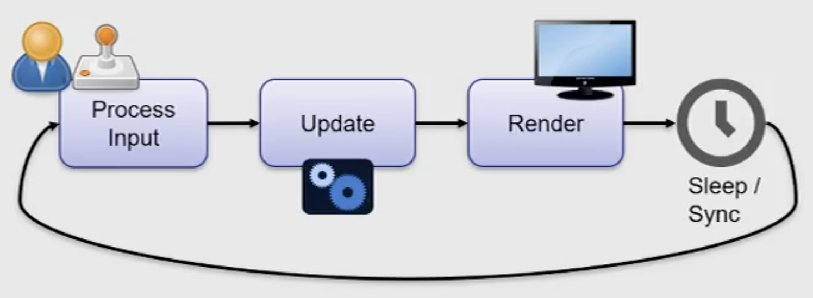

# Game Engines

## Important Concepts

- Linear Transformations of Homogenous Coordinates or Homogenous Linear Transformations in 3D
  - Affine transformations
  - Transformation order
- Projection models
- Quaternions
- Matrix Stacks
- Scene graphs
- Phong reflection model

## Basic Game Engines

### The Kernel

- Frame-based
- Closed loop where player is part of the overall system

