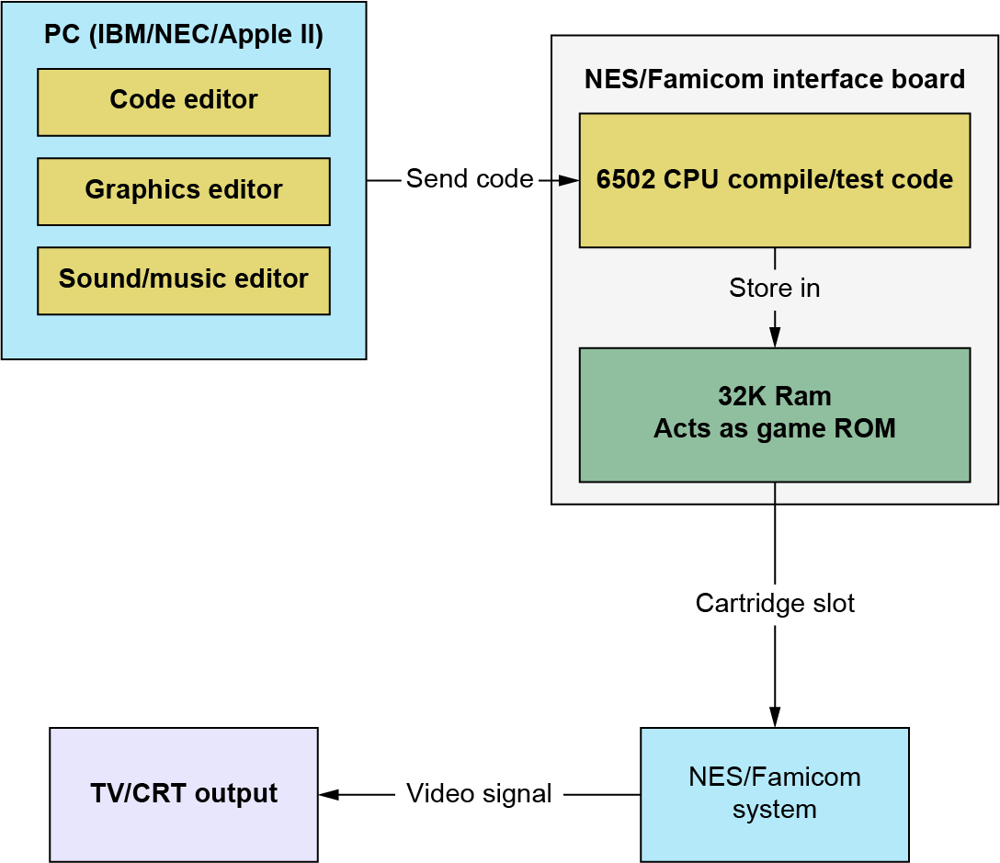
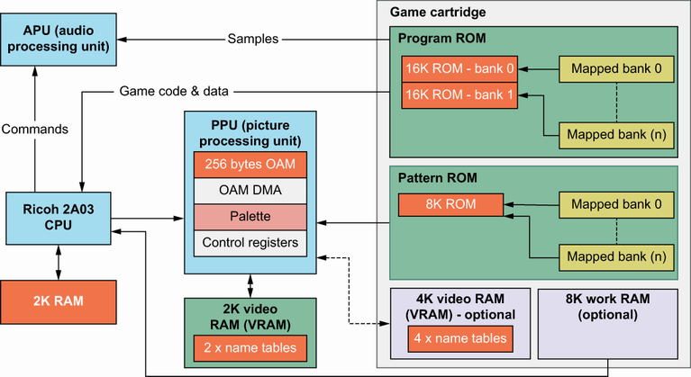
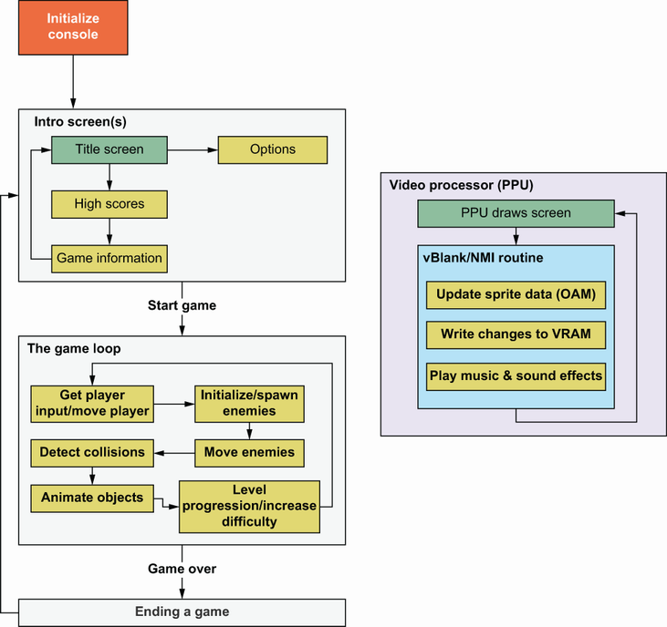
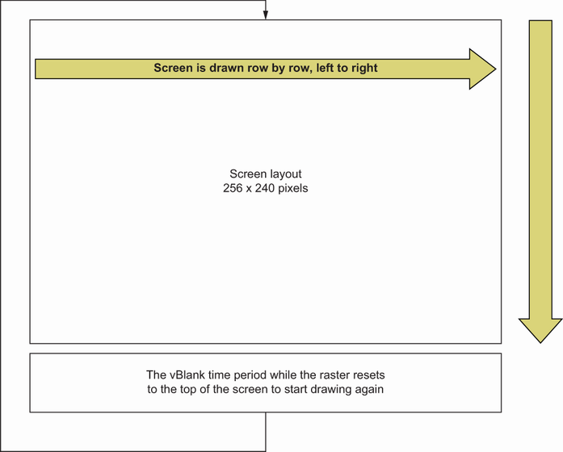

# NES Programming

## Development

## NES Architecture

-   Ricoh 2A03 CPU (mostly 6502 compatible) with 2K of RAM
-   A PPU that handles displaying all images on screen
    -   Has 2K of Video RAM (VRAM)
        -   Can optionally be added to with RAM from the game cartridge
        -   Patterns used for the tiles and sprites come from an 8K section of the game cartridge
    -   Can be supplied by the game cartridge as a single fixed 8K ROM area, as a bank switchable 8K area, or even as 8K of RAM that can be written to by the CPU
-   An APU that handles all sound output and is programmed via commands from the CPU
-   The game cartridge
    -   Contains program and data space that is either fixed or bank switched banks with a maximum of 32K available at any one time
    -   Contains an 8K section for the Pattern tables and can optionally add more VRAM, work RAM, or even battery-backed RAM for saving game progress

## 6502 Assembler

-   The NES console uses a slightly modified version of the popular 8-bit 6502 microprocessor
    -   Was used in many computers and consoles from the late 1970s through most of the 1980s
-   Possible to use higher-level languages (such as C) to make NES games, but due to the limited processing power of the system, use of assembly is required to achieve some features

## Game Structure

### Console Initialization

The NES console has no built-in operating system, so we need to start with the following steps:

-   Wait for the video hardware and the rest of the NES components to be ready
-   Clear memory so we have a known starting set of values
-   Initialize sound hardware and ensure any existing sounds are turned off
-   Detect which game controllers are connected depending on which ones our game will support
-   Depending on how the tile and sprite patterns are stored in the game ROM, they may need to be transferred to graphics chip (PPU) video memory

### Drawing Changes

-   The PPU (the graphics chip) handles the drawing of the contents of the screen multiple times per second
-   What the PPU draws to the screen is contained in special RAM areas known collectively as video RAM (VRAM)
    -   The VRAM is not directly accessible from the 6502 CPU, and changes to VRAM need to be sent from ROM or RAM to the PPU via a set of control ports
    -   Changes to VRAM can only be made when the PPU chip is not busy drawing the screen
-   The screen is drawn, one row at a time, from left to right, until it reaches the bottom of the screen
-   Once the bottom of the screen has been reached, the PPU chip raises a signal (the vBlank Interrupt)
    -   The PPU then waits for the raster, which is drawing the screen, to return to the top in order for it to start drawing again
    -   This vBlank period is the time to change things in VRAM while the PPU chip is not using it
    -   The vBlank signal from the PPU graphics chip causes a non-maskable interrupt (NMI) to be generated for the 6502 CPU

